# Educative Lab
## Symbols used

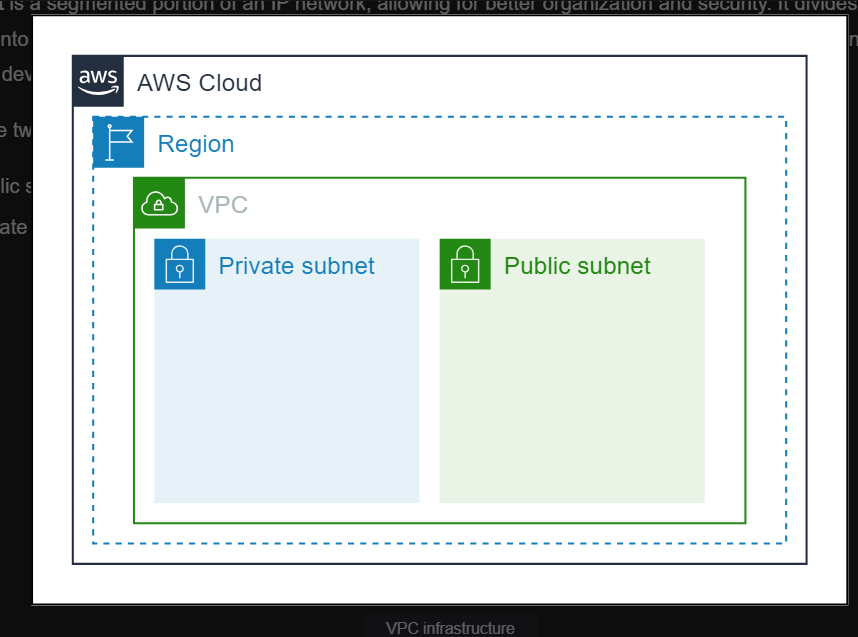

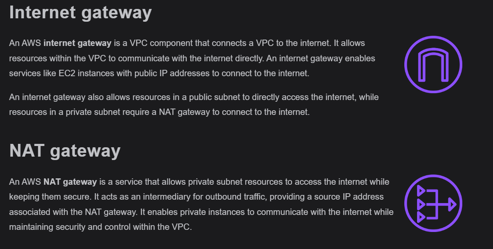

## Create a VPC

In this task, we’ll provision a VPC consisting of public and private subnets, an internet gateway, and a NAT gateway to connect resources in the private subnet to the internet.

After completing this task, the provisioned infrastructure should look like the one shown in the figure below:

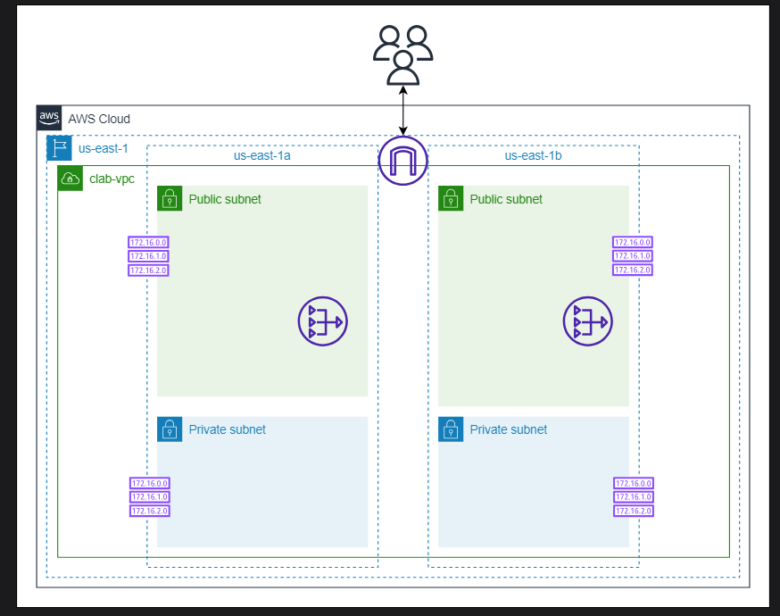

Let’s create a VPC by following the given steps:

- Search for “VPC” and select “VPC” from the AWS Management Console. It takes us to the VPC dashboard.

- Click “Your VPCs” under the “Virtual private cloud” heading in the left menu bar.

- Click the “Create VPC” button.

- Configure the following settings under the “VPC settings” section:

    - For “Resources to create,” select “VPC and more.” This step will set up the VPC based on the requirements specified below. 

    - For “Name tag auto-generation,” enter clab.

    - For “IPv4 CIDR block,” ensure 10.0.0.0/16 is entered. (The Classless Inter-Domain Routing [CIDR] block is a way to specify the range of IP addresses for a network.)

    - Under “IPv6 CIDR block,” ensure “No IPv6 CIDR block” is selected.

    - For “Tenancy,” ensure “Default” is selected from the drop-down list.

    - For “Number of Availability Zones (AZs),” select “2.” Under “Customize AZs,” ensure us-east-1a and us-east-1b is selected for availability zones.if you increase to 3 ,it will be in 3 AZs

    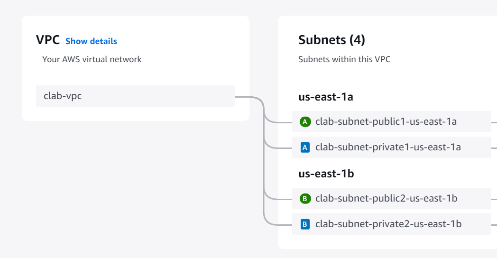
    Case of 2
    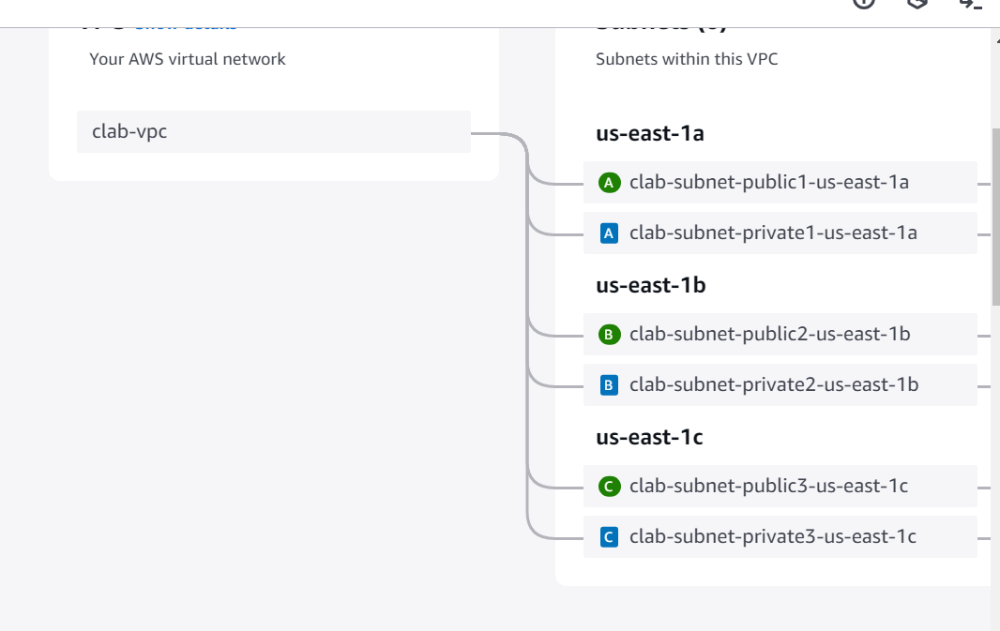
    if selected 3
    - Ensure that “2” is selected for “Number of public subnets” and “Number of private subnets.” Ignore “Customize subnets CIDR blocks” for this lab.

    - For “NAT gateways ($),” select “1 per AZ” to create a NAT gateway in both AZs for the private subnets.

    - For “VPC endpoints,” select “None” because we won’t need a VPC endpoint in this lab.

    - For “DNS options,” select “Enable DNS hostnames” and “Enable DNS resolution.”

    - Leave the “Additional tags” section as it is and click the “Create VPC” button at the end of the page.

This might take some time to complete all the steps and launch. We’ll see a “View VPC” button indicating that our VPC has been successfully created. Click the “View VPC” button to view the newly created VPC, clab-vpc, and copy the VPC ID from the “Details” section.

In the next task, we’ll create a security group to secure the resources in the lab.


## Create a Security Group

A security group controls the inbound and outbound traffic for an associated resource. In other words, it acts as a firewall for the resource.

In this task, we’ll create a security group allowing SSH and HTTP connections to the resources.

After completing this task, the provisioned infrastructure should look like the one shown in the figure below:

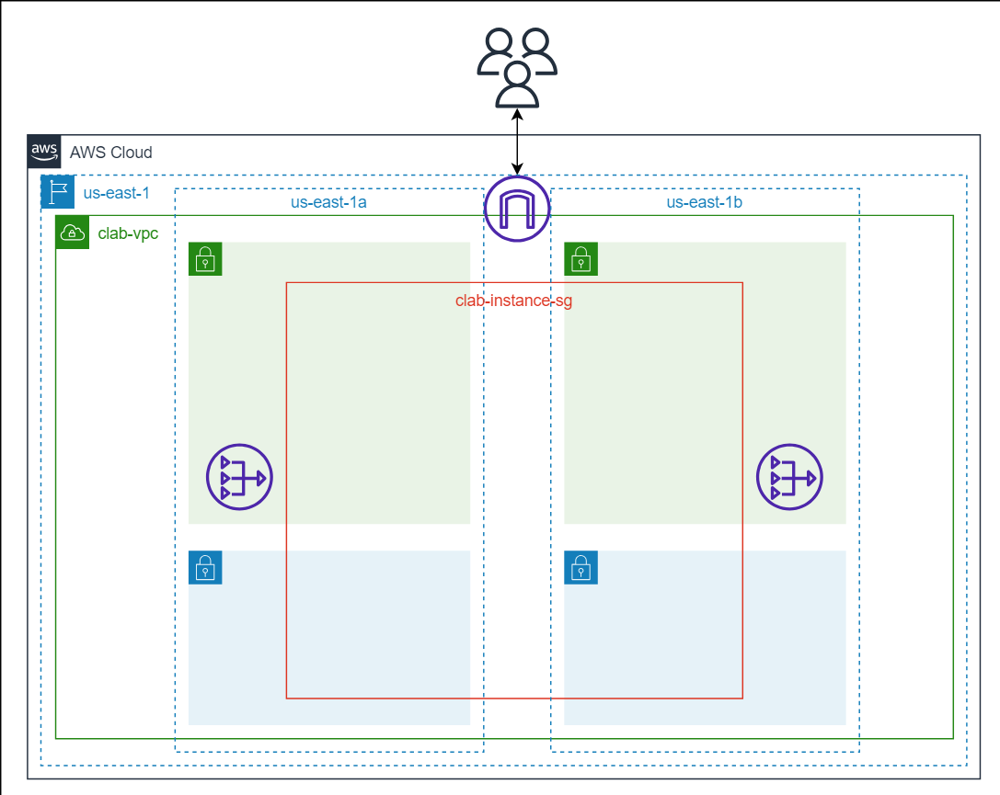

Let’s create a security group we’ll use in the next tasks.

On the AWS Management Console, search for “EC2” and click the EC2 service from the search results. This takes us to the EC2 dashboard.

In the sidebar, click the “Security Groups” option under the “Network & Security” section.

Click the “Create security group” button.

Follow these steps to configure and create the security group:

Basic details:

- Enter clab-instance-sg as the security group name.

- Enter Security group to allow inbound requests on ports 3000 and 22 as per the description.

- Paste the VPC ID of the newly created VPC, clab-vpc, under the “VPC” option.

Inbound rules:

- Click the “Add rule” button under “Inbound rules.”

- Select SSH as the type.

- Enter Anywhere-IPv4 as the source.

- Add the second inbound rule as follows:

- Click the “Add rule” button under “Inbound rules.”

- Select Custom TCP as the type.

- Set the port range to 3000

- Enter Anywhere-IPv4 as the source.

Outbound rules:

- Keep the existing default rule because we don’t need to change or add any outbound rules.

Tags:

- For this lab, we won’t include tags. Leave it as it is.

Once we’re done with the steps above, click the “Create security group” button.

## Set Up an Application

In this task, we’ll launch EC2 instances and set up a React-based application with a Node.js backend. The frontend of our application will be set up on an EC2 instance running in the public subnet and, therefore, accessible from the internet using the internet gateway. The backend of our application will be set up on an EC2 instance running in the private subnet to ensure that it’s not directly accessed from the internet.

After the completion of this task, the provisioned infrastructure would be similar to the one shown in the figure below:

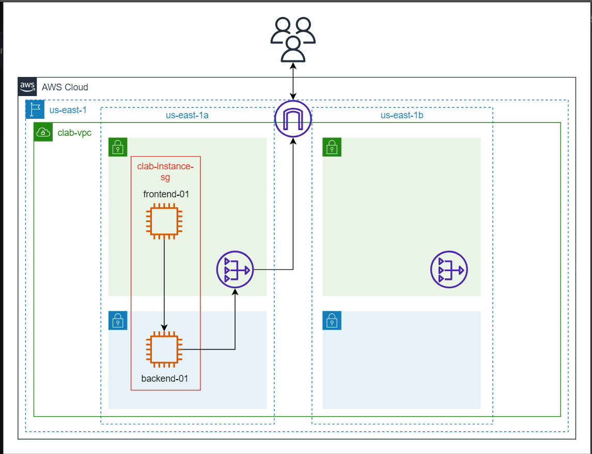

### Launch the backend of the application
Follow the steps given below to launch an EC2 instance in a private subnet:

- From the left sidebar, select “Instances” and click “Launch Instances.”

- In the “Name and tags” section, provide clab-backend-01 as the instance’s name.

- In the “Application and OS Images (Amazon Machine Image)” section, select “Amazon Linux” as the AMI.

- Select “Amazon Linux 2023 AMI” from the drop-down menu available under “Amazon Machine Image (AMI).”Ensure the selected architecture is “64-bit (x86).” Select “t2.micro” as the instance type.

- In the “Key pair (login)” section, select “Proceed without a key pair (Not recommended)” from the drop-down menu.

- In the “Network settings” section, do the following:

    - Click the “Edit” button.

    - Under “VPC,” select the created VPC, clab-vpc.

    - Under the “Subnet” option, select clab-subnet-private1-us-east-1a.

- Make sure the “Auto-assign public IP” is set to “Disable.” The instance will be in the private subnet, so a public IP is unnecessary.

- Under the “Firewall (security groups)” subsection, select “Select existing security group” and choose the security group we created earlier, clab-instance-sg, from the drop-down menu.

- In the “Configure storage” section, do the following:

   -  Ensure 8 GiB is selected as the storage and “gp3” is selected as the root volume.

- Open the “Advanced details” section and scroll down to the bottom of that section.

    - Enter the following script in the input field under “User data” at the bottom:


```bash
#!/bin/bash
#Installing Git
sudo yum -y update &&\
sudo yum -y install git &&\

sudo yum install https://rpm.nodesource.com/pub_16.x/nodistro/repo/nodesource-release-nodistro-1.noarch.rpm -y &&\
sudo yum install nodejs -y --setopt=nodesource-nodejs.module_hotfixes=1 &&\

git clone https://github.com/Educative-Content/understanding-networking-services-cl-backend-api &&\
cd understanding-networking-services-cl-backend-api && cd simple-node-api/ && npm install cors &&\
npm start 
```
- Review the configurations and click the “Launch instance” button.

### Launch the frontend of the application
Follow the steps given below to launch an EC2 instance in a public subnet:

- In the “Name and tags” section, provide clab-frontend-01 as the name of the instance.

- Perform the same steps as above for clab-backend-01, except for the “Network settings” and “Advanced details” parts.

- For the “Network settings” section, do the following:

    - Click the “Edit” button and select the created VPC, clab-vpc, under “VPC.”

    - Under the “Subnet” option, select clab-subnet-public1-us-east-1a.

    - For “Auto-assign public IP,” select “Enable.” The instance will be in the public subnet, so a public IP is required.

   - Under the “Firewall (security groups)” subsection, select “Select existing security group” and choose the security group we created earlier, clab-instance-sg, from the drop-down menu.

- For the frontend, in the “Advanced details” section, we’ll keep the settings at default.

- Review the configurations and click the “Launch instance” button.

- After the successful instance launch, connect to the created instance, clab-frontend-01, once the “Instance state” shows that its status is “Running.”

- Check the instance state against the newly launched instance, clab-frontend-01. Once the state is changed from “Initializing” to “Running,” select the newly launched instance, clab-frontend-01, and click the “Connect” button.

- Keep the settings at default and click the “Connect” button to access a terminal connected to our EC2 instance.

Paste the following commands in the terminal.
```bash
sudo yum -y update &&\
sudo yum -y install git &&\

sudo yum install https://rpm.nodesource.com/pub_16.x/nodistro/repo/nodesource-release-nodistro-1.noarch.rpm -y &&\
sudo yum install nodejs -y --setopt=nodesource-nodejs.module_hotfixes=1 &&\

git clone https://github.com/Educative-Content/understanding-networking-service-cl-frontend-app &&\
cd understanding-networking-service-cl-frontend-app &&\
npm install && cd src && nano setupProxy.js
```


>Note:Note: It might take some time to complete the installation. After the installation, setupProxy.js will be open to edit.

Meanwhile, from “Instances,” ensure the “Status check” section of clab-backend-01 is “2/2 checks passed.” Select clab-backend-01 and copy the private IP address of clab-backend-01.

Now, go back to the terminal of clab-frontend-01 and update the private IP of clab-backend-01 in \<YOUR_PRIVATE_IP_ADDRESS\> against the target as:


```bash
target: 'http://<YOUR_PRIVATE_IP_ADDRESS>:3000' // Specify the target URL where your API is hosted
```
- Press “Control + x,” then press “y” to save the modified changes in the file, and press “Enter” to keep the unedited file name and safely exit the nano editor.

-After this, run `npm start`


 our application is live on \<clab-frontend-01_PublicIP>:3000

Congratulations on launching your React application with node js backend. You launched frontend on an EC2 instance in the public subnet and backend on the EC2 instance in the private subnet. The current architecture ensures that the backend is not accessible from the internet, thus ensuring a secure backend. However, incase of failure of the backend, the entire application data will become inaccessible. To resolve such issues, we will try to make our application more resilient.

In the next task, we’ll see how to set up a resilient application and why it’s important.

## Create Launch Templates

A resilient application is designed to maintain high availability and reliability despite failures or disruptions. It employs architectural strategies like redundancy, fault tolerance, and load balancing to ensure continuous operation. It includes deploying resources across multiple AZs and regions to guard against localized failures. Utilizing services like Auto Scaling and Elastic Load Balancing further enhances resilience by dynamically adjusting resource capacity in response to changing demand.

A resilient AWS application is engineered to provide uninterrupted service and minimize downtime, offering a robust user experience even in adverse conditions. Let’s try to make our application more resilient by deploying in different AZs so that the application is accessible even if a failure exists in one of the AZs.

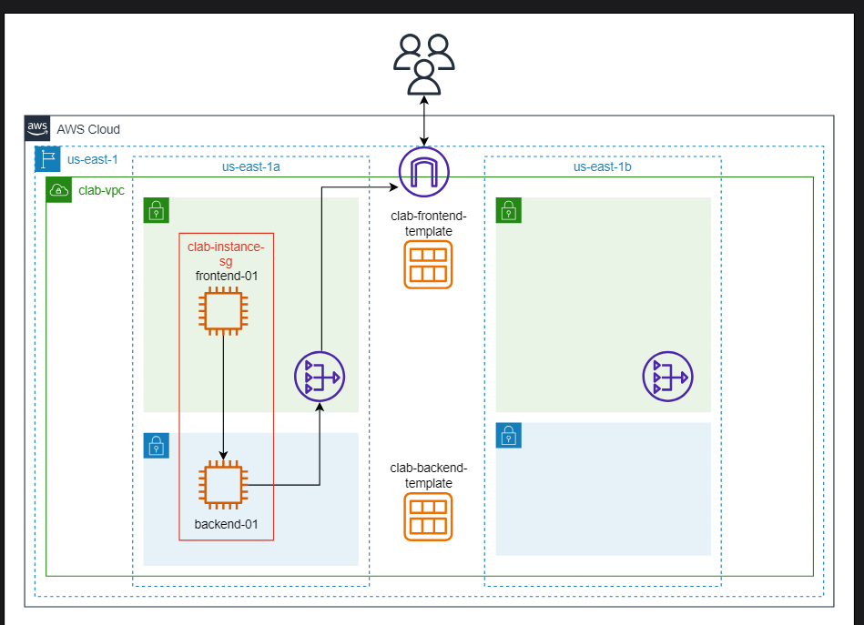
### Launch template for the backend instance
To launch an application in another AZ, we’ll create a launch template of our current EC2 instances. This will help us launch more similar instances when needed.

Follow the steps below to create launch templates from earlier created instances. First, we’ll create a launch template from clab-backend-01.

- Select the instance, clab-backend-01, and from the “Actions” drop-down menu, select “Image and templates” and then click “Create template from instance.”Under “Launch template name,” write clab-backend.

- Under “Application and OS Images (Amazon Machine Image),” select “Recents” and then check the option “Currently in use.”Select “t2.micro” as the instance type from the drop-down menu.

- In the “Key pair (login)” section, select “Don’t include in launch template” from the drop-down menu.

- In the “Network settings” section, do the following:

    - Under the “Subnet” option, select “Don’t include in launch template.”

    - Under the “Firewall (security groups)” subsection, select “Select existing security group” and choose the security group we created earlier, clab-instance-sg, from the drop-down menu.

- Keep “Storage (volumes)” and “Resource tags” by default.

- Open the “Advanced details” section and scroll down to the bottom of that section.

- Enter the following script in the input field under “User data” at the bottom:

```bash
#!/bin/bash
#Installing Git
sudo yum -y update &&\
sudo yum -y install git &&\

sudo yum install https://rpm.nodesource.com/pub_16.x/nodistro/repo/nodesource-release-nodistro-1.noarch.rpm -y &&\
sudo yum install nodejs -y --setopt=nodesource-nodejs.module_hotfixes=1 &&\

git clone https://github.com/Educative-Content/understanding-networking-services-cl-backend-api &&\
cd understanding-networking-services-cl-backend-api && cd simple-node-api/ && npm install cors &&\
npm start 
```

- Review the configurations and click the “Create launch template” button.

- Click the “View launch templates” button once the template is created.

### Launch template for the frontend instance
Now, we’ll create a launch template from clab-frontend-01. Name the template clab-frontend and follow the same steps as the ones for clab-backend, except the “Network settings” part.

- For the “Network settings” section, do the following:

- Under the “Subnet” option, select “Don’t include in launch template.”

- Under the “Firewall (security groups)” subsection, select “Select existing security group” and choose the security group we created earlier, clab-instance-sg, from the drop-down menu.

- Under the “Advanced network configuration” section, click “Add network interface,” and from the drop-down menu under the “Auto-assign public IP,” select “Enable.”

- Keep the rest of the settings at default.

- Review the configurations and click the “Create launch template” button.

- Click the “View launch templates” button once the template is created.

## Launch Instances

In this task, we’ll launch EC2 instances from the launch templates we created in the previous task. First, we’ll launch the backend instance and then launch and configure the frontend instance.

After the completion of this task, the provisioned infrastructure would be similar to the one shown in the figure below:

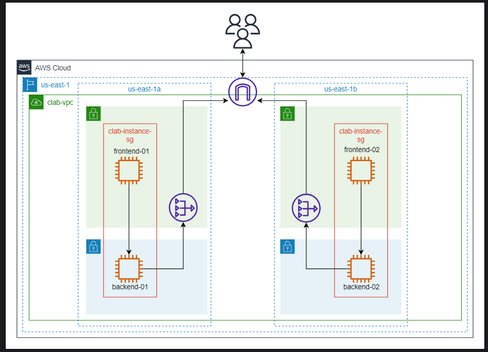

### Launch the backend instance from the template
Now, we’ll run the instance from the newly created template, clab-backend.

- Click the “Launch instances” drop-down menu and select “Launch instance from template.”

- Select clab-backend from the drop-down list under “Source template.”

- Scroll down to “Key pair (login)” and select “Proceed without a key pair (Not recommended)” from the drop-down menu.

- In the “Network settings” section, do the following:

- Under the “Subnet” option, select clab-subnet-private2-us-east-1b.

- Keep other settings at default.

- Review the configurations and click the “Launch instance” button.

- Click the “View launch templates” button once the instance is created.

- Click the "Instances" from the left navigation and modify the name of the newly created instance to clab-backend-02 by clicking under the “Name” column of the instance.

### Launch frontend instance from the template
Now, we’ll run the instance from the newly created template, clab-frontend.

- Click the “Launch instances” drop-down menu and select “Launch instance from template.”

- Select clab-frontend from the drop-down list under “Source template.”

- Scroll down to “Key pair (login)” and select “Proceed without a key pair (Not recommended)” from the drop-down menu.

- In the “Network settings” section, do the following:

    - Under the “Subnet” option, select clab-subnet-public2-us-east-1b.

    - Keep other settings at default.

- Review the configurations and click the “Launch instance” button.

- Click the “View launch templates” button once the instance is created.

- Click the "Instances" from the left navigation and modify the name of the newly created instance to clab-frontend-02 by clicking under the “Name” column of the instance.


- After the successful instance launch, connect to the created instance, clab-frontend-02, once the instance state is “Running.”

- Check the “Instance state” against the newly launched instance, clab-frontend-02. Once the state is changed from “Initializing” to “Running,” select the newly launched instance, clab-frontend-02, and click the “Connect” button.

- Keep the settings at default and click the “Connect” button to access a terminal connected to our EC2 instance.

Paste the following commands in the terminal.

```bash
sudo yum -y update &&\
sudo yum -y install git &&\

sudo yum install https://rpm.nodesource.com/pub_16.x/nodistro/repo/nodesource-release-nodistro-1.noarch.rpm -y &&\
sudo yum install nodejs -y --setopt=nodesource-nodejs.module_hotfixes=1 &&\

git clone https://github.com/Educative-Content/understanding-networking-service-cl-frontend-app &&\
cd understanding-networking-service-cl-frontend-app &&\
npm install && cd src && nano setupProxy.js
```

- Meanwhile, from “Instances,” ensure that the “Status check” setting of clab-backend-02 is “2/2 checks passed.” Select clab-backend-02 and copy the private IP address of clab-backend-02.

- Now, go back to the terminal of clab-frontend-02 and update the private IP of clab-backend-02 in \<YOUR_PRIVATE_IP_ADDRESS> against the target as:

- Press “Control+x,” then press “y” to save the modified changes in the file, and press “Enter” to keep the unedited file name and safely exit the nano editor.

- After this, run the React application using `npm start`

- Now, our application is live on \<clab-frontend-02_PublicIP>:3000. Copy the public IP from the bottom of the terminal page and paste it into the new browser page to view the application.
### Observations
Now, we have two applications running in two different AZs; each application’s frontend is directly connected to its backend. The application running in two different AZs ensures higher availability than the previous architecture in a single AZ. However, the new infrastructure has its own problems, which doesn’t make it a practical solution. We can see in the architecture diagram above that a failure of either backend will cause the unavailability of the application’s data.

Similarly, in the case of failure in the frontend instances of either AZ, the entire application breaks down. Furthermore, the instances deployed in one AZ can’t establish a connection with the instances in the other AZ. Therefore, manually adding, removing, and performing health tests on instances to ensure availability is not viable.

## Configure an Internal Load Balancer

In this task, we’ll improve the resilience of our backend, ensuring high availability using an application load balancer and then connecting the load balancer with the backend of the application in each AZ.

An AWS load balancer is a managed service that evenly distributes incoming network traffic across multiple targets, such as Amazon EC2 instances. It enhances the application’s availability and fault tolerance by automatically rerouting traffic away from failed or unhealthy targets. AWS offers different load balancers, including Application Load Balancers for HTTP/HTTPS traffic and Network Load Balancers for TCP/UDP traffic, each tailored to specific use cases.

Load balancers direct incoming traffic based on the request attributes to instances called targets. The instances that serve as targets form a logical grouping called target groups.

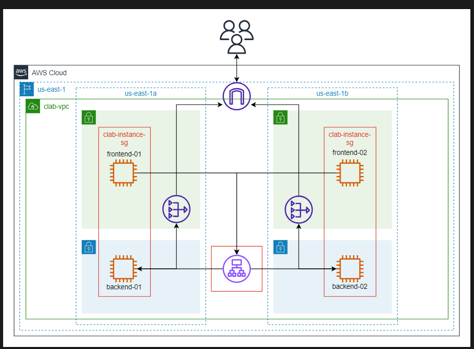

### Create a target group
Follow the steps below to create the target group:

- On the AWS Management Console, search for “EC2” and click the EC2 service from the search results. This takes us to the EC2 dashboard.

- Click “Target Groups” from the sidebar under “Load Balancing.”

- Click the “Create target group” button.

- Ensure that “Instances” is selected under “Choose a target type.” This ensures traffic is forwarded to EC2 instances created within our specified VPC.

- Set the name of the target group to clab-internal-tg.

- Ensure that “HTTP” is selected under “Protocol” and that the port is set to 3000. This specifies the protocol and the port the application load balancer uses to route traffic to the targets registered within the target group.

- Ensure “IP address type” is “IPv4.”

- Select the created VPC, clab-vpc, under the “VPC” section and ensure the “Protocol version” is “HTTP1.”

- In the “Health checks” section:

    - Set the “Health check path” to the back-end path parameters of our application, /api/books.

    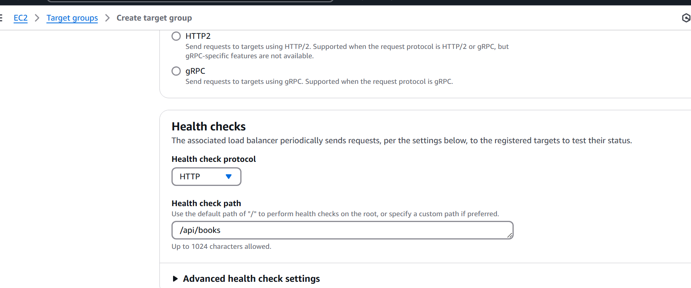

    - Open the “Advanced health check settings” section.

        - From the “Health check port” section, select the “Override” option, and set the port to 3000.

        - For now, keep the rest of the health settings at default. However, we can configure several thresholds and timeouts for the health checks, including the number of health checks that an instance must fail before being considered unhealthy, the time between consecutive health checks, and others.

- We’ll keep other settings at default and click “Next” to proceed.

- The “Register targets” page allows us to register EC2 instances within our chosen VPC as targets where traffic will be routed.

- Select both clab-backend-01 and clab-backend-02 and click “Include as pending below” to add those instances as a target. Ensure that the port is set to 3000.

- Click the “Create target group” button.

### Load balancer security group
Follow the steps below to create the security group for the Application Load Balancer:

- From the sidebar, click “Security Groups” under “Network & Security.”

- Click the “Create security group” button.

- Name the security group clab-balancer-sg and set the description to Allow Custom HTTP 3000 access.

- Paste the “VPC ID” of the newly created VPC, clab-vpc, under the “VPC” option.

- Click the “Add rule” button under the “Inbound rules” section to add a new inbound rule. Configure the new rule as follows:

- Select Custom TCP from the “Type” drop-down.Set the port to 3000 because our application runs on that port.Select Anywhere-IPv4 from the “Source” drop-down menu; this sets the IP address range to 0.0.0.0/0.

- Once we’re done with the steps above, click the “Create security group” button.

With these configurations, we’ve defined a security group for our load balancer to only allow HTTP requests on port 3000.

### Create an internal Application Load Balancer
Follow the steps below to create the Application Load Balancer:

- From the sidebar, click “Load Balancers” under the “Load Balancing” option.

- Click the “Create load balancer” button.

- Since we want to create an Application Load Balancer, click the “Create” button under the “Application Load Balancer” option.

- Name the load balancer clab-internal-alb.

- Ensure that “Internal” is selected under “Scheme” because we don’t want the internet to access the internal load balancer.

- Ensure that “IPv4” is selected under “IP address type.”

- Select the created VPC, clab-vpc. Create the load balancer in the same VPC where the instances are launched.

- Select all AZs under “Mappings.” Each mapping corresponds to a separate subnet in a different AZ. The load balancer will route traffic to targets within the selected AZ and subnet. Ensure private subnets are selected in mappings rather than public because our Application Load Balancer, clab-internal-alb, is for internal communication within the VPC.

- Under the “Security groups” section, deselect the default security group and select clab-balancer-sg from the drop-down menu.

- Under the “Listeners and routing” section, ensure that “HTTP” is selected under “Protocol” and the port is set to 3000.

- Select clab-internal-tg from the “Select a target group” drop-down menu.

- Click the “Create load balancer” button.

Click “View load balancer” to return to the “Load Balancers” page, where our newly created load balancer should be visible. Now, we’ll access the backend through the newly created Application Load Balancer, clab-internal-alb.

Let’s update the backend IP address in both clab-frontend-01 and clab-frontend-02.

- Copy the DNS name of the load balancer once the load balancer state is active.

- Now, go back to the terminal and use “Control + C” in both terminals (clab-frontend-01 and clab-frontend-02 ) to quit the server.

- Open SetupProxy.js using the following command in both terminals.

```bash
nano setupProxy.js
```

- Update the IP of clab-frontend-01 and clab-frontend-02 and replace the private IP with the copied DNS name in place of \<clab-backend_PRIVATE_IP_ADDRESS>:3000 against the target as:

- Press “Control+x,” then press “y” to save the modified changes in the file, and press “Enter” to keep the unedited file name and safely exit the nano editor.
 run by `npm start`
Now, the application is again live on both \<clab-frontend-01_PublicIP>:3000 and \<clab-frontend-02_PublicIP>:3000. Copy the public IP from the bottom of the terminal page and paste it into a new browser page to view the application.
## Configure an External Load Balancer

In the next task, we’ll learn how we can further improve resilience. We’ll configure an external load balancer to avoid a single point of failure in the frontend and manage requests in case of failure in one of the frontends.

After the completion of this task, the provisioned infrastructure would be similar to the one shown in the figure below: