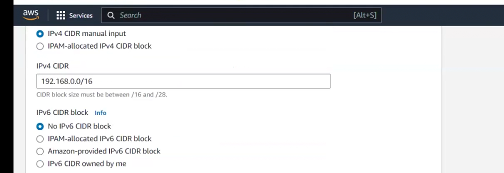
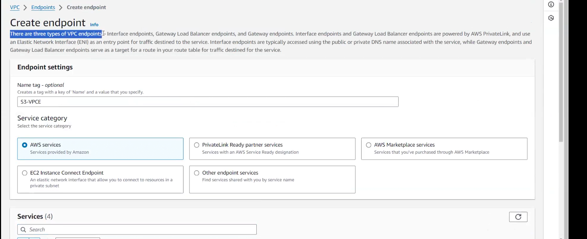

# lecture 49 VPC practical
## Steps
- create VPC 192.168.0.0/16
- create IGW and attach to vpc
- create public subnet 192.168.1.0/24
- create private subnet 192.168.2.0/24
- create NAt in public subnet and EIP is associated
- create public routing table and all taffic(0.0.0.0/0) of public subnet is routrd to IGW
- crate private routing table and all traffic in private subnet to NAT
- create new security group 
- launch baston server in public subnet
- launch private server in private subnet
- connet baston to private server

## Practical

let us see default VPC in Mumbai first!! As there no private subnet so no NAT!

>Note:when you create a new VPc, default security group ,NACL ,route table(main table) 
is created automatically!!

### Steps

- Create VPC ,Create VPC only not VPC and more as it will autoselect many things!!
- give name
- IPV4 manual input

    

- Tenancy default as on dedicated , dedicated bill will come
- click on create VPC

- Go to internet gateway and add tag and create it

- It will be in detached mode so go to Actions>Attach to VPC and select VPC you just created!

>Note: 1 IGW can be attached to 1 VPC

- Go to subnet and create subnet

>Note: 1 subnet attched to 1 AZ

Just like this create a private subnet!!

Now let us create NAT

- Create NAT put in public subnet, connectivity--> public and allocate elastic IP!!

- now on left we have route tables we need to create public and private 
route tables

- now select public route table and we need all traffic route to IGW!!

Go to routes and make all traffic (0.0.0.0/0) to IGW!!

Also in subnet assoiations of this table >edit subnet assoiations and associate the public subnet to it!!

similarly add route of private subnet table to NAT and association of private table to private subnet!!

- now create security group for VPC you created!!

for linux machine we put ssh rule in inbound rules!! for outbound rules no need to worry!!

In inbound rules we create a default rule always to all tarffic to the security group only!!

All traffic to self in inbound rules!!

- Launch ec2 instances -select Vpc you have created and then public subnet for bastion server and enable public ip 
must be selected and select your own created security group

create one more private server!! as private disable public ip!!

choose redhat as ec2 AMI!!

- one correction edit vpc settings by actions and enable DNS hostnames

now bastion server will have public DNS!!

- to connect to private server use SSH command given by aws in public bastion server!!

and connect to it in that bastion instance!! both ec2 are connected by private ip!!
both ec2 in a network connected by private ip!

to give read access of a file we give `chmod 400`

You see you able to connect!!

to go to admin we use command `sudo -s`

to check interent access use 

`yum install -y wget`--> if you have interent access then able to download

>Note: If in private routing table you delete NAT route then not able to access internet!!

`yum install -y httpd`--> will not run if not having internet!!

if windows then we use RDP!!

## VPC endpoint practical

Now we do not want internet access from bastion ,we just need access(any AWS service) AWS s3!!
if we want access we need to have VPC endpoint ,we no need of NAT then!!

- first install AWS CLI!! just google it!! and remove NAT then after installing AWS CLI!!

- now we can use keys but that is not good so we use IAM role , we give private server an IAM role for 
s3 bucket full access!! and attach role to private ec2 !!

- remove NAT from route of private route table!!

here we created bucket before removing NAT!! this is just to show commands to run!!

- go to left side in VPC and check for endpoints!

in services select S3!!

select the GAteway one !! For rest 3 you can read about type of vpc endpoints!!

select VPC , now s3 traffic should route to VPC endpoint so select private route table!!as any s3 traffic will route to 
private routing table!!

You able to see private routing table the endpoint is added!!

>Note:for each service you need to create endPoint!!

## how to delete VPC
1. terminate ec2 instances
2. delete NAT
3. delete VPC (IGW will be deleted automatically)
4. delete(relese) elastic IP

In vpc >Actions > create flow logs

in flow logs traffic is monitored and can be stored in S3!! It is billable!!

## VPC peering

Two VPC communicate by VPC peering!!Two VPC can be another region , another account !!

In ireland we create another VPC!!

>Note:CIDR should be unique so in ireland we can not use same CIDR!

so In ireland we use 192.169.0.0/16!!

we caanot connect two private subnet in two different VPCs!! We can acheive it by VPC peering!!

from company to AWS we connect by VPN!!
At AWS we need to configure 3 things from VPC dashboards
1. VPG (virtual private Gateway)(just need to give name)
2. Customer Gateway --> give IP adress of company
3. side to side VPN

Then AWS gives you configuration file and that configuration file you neeed to give to company!!

2 tunnels will be created if one goes down other will be up!!

Network ACLs (NACLs)

add inbound rules for SSH and now you will not be able to connect  to machine!!
as NACL has denied it!!do for mumbai VPC!!

If you want to connect multiple VPC you can set routing table using transit gateway!!

