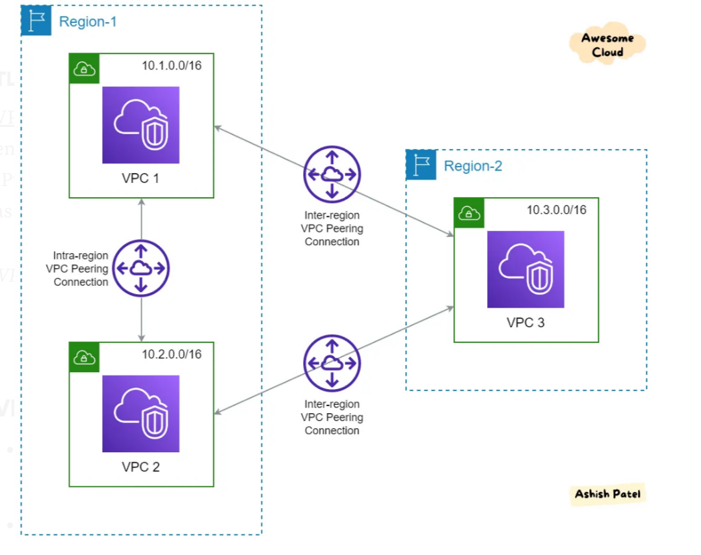

# Notes Lec-50

- set up 2 vpc!!One vpc in mumbai and another in Ireland!!
- Attach internet gateway to both
- create public subnet!! create below architecture!!

and set up vpc peering!! Peering is done private to private!!

If you are doing in another region so another vpc security group should accept traffic from the region!!

See notes in drive for this peering!!

