# AWS infrastructure
The services and resources provided by AWS are housed in data centers. These data centers are spread out strategically to optimize availability and decrease network latency. The locations are categorized among regions and availability zones. The diagram given below illustrates the divison among regions and availability zones.

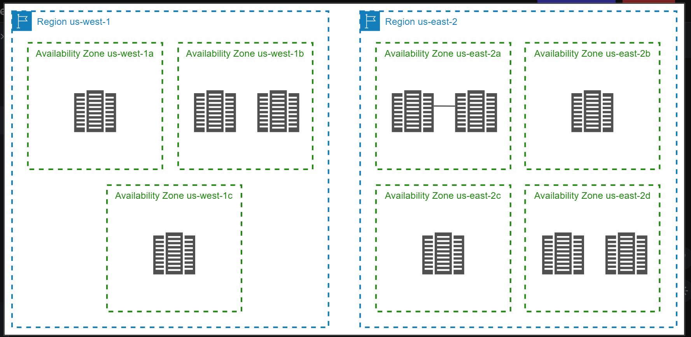

### Regions
In an AWS cloud, AWS Regions are the largest unit. They are separate geographic locations. Each region consists of clusters of data centers called Availability Zones. Currently, AWS supports seven regions, including Asia, North America, South America, and more. 

### Availability Zones
As discussed above, regions consist of availability zones. Availability Zones are essentially data centers to host AWS resources. Each region consists of at least three availability zones. These zones increase the fault tolerance of the region. All of the Availability Zones within a region are connected to each other via dedicated channels with high bandwidth

### Create an IAM User

Identity Access and Management (IAM) users are entities created within an AWS account to represent individual users who need access to AWS services and resources. IAM users have associated security credentials, such as access keys and passwords, which allow AWS to authenticate the users. IAM users also have a policy attached (directly or indirectly) that specifies the authorization rights of the user called identity-based policies. Identity-based Policies specify the actions and services a user is allowed. eg

```json
{
    "Version": "2012-10-17",
    "Statement": [
        {
            "Sid": "PolicyToGetS3Objects",
            "Effect": "Allow",
            "Action": "s3:GetObject",
            "Resource": "*",
            
        }
    ]
}
```

Let’s briefly discuss some important fields of the policy shown above:

- Version: It helps AWS understand the version of the syntax used in the policy.

- Statement: It contains the main element of the policy. A statement can have a single or multiple blocks.

- Effect: It specifies whether the statement allows or denies access.. It can have two values: “Allow” or “Deny.”

- Action: It defines the AWS actions that the policy is granting or denying permission for. In this case, the statement is allowing GetObject action of the S3 service.

- Resource: It specifies the AWS resources to which the statement’s permissions apply. Resources are identified using Amazon Resource Names (ARN). In the policy given above, the symbol * specifies that the policy applies to all resources.

The policy given above allows the user to get objects from an S3 bucket. 
### user creation
Let’s create an IAM user by following the given steps:

- Search “IAM” in the search bar on top of the AWS Management Console. Click “Users” under “Access management” from the left sidebar. This takes us to a list of all available users in our account.

- Click the “Create user” button to create a new user.

- Name the user IAMLabUser.

- Check the “Provide user access to the AWS Management Console - optional” option.

- For “Console password,” we can either select the “Autogenerated password” option or the “Custom password” option and set a password of our choice. We’ll select the “Autogenerated password” option.

- Uncheck the “Users must create a new password at next sign-in (recommended).” option and click the “Next” button.

- On the “Set permissions” page, select the “Attach policies directly” option from the “Permissions options” section.

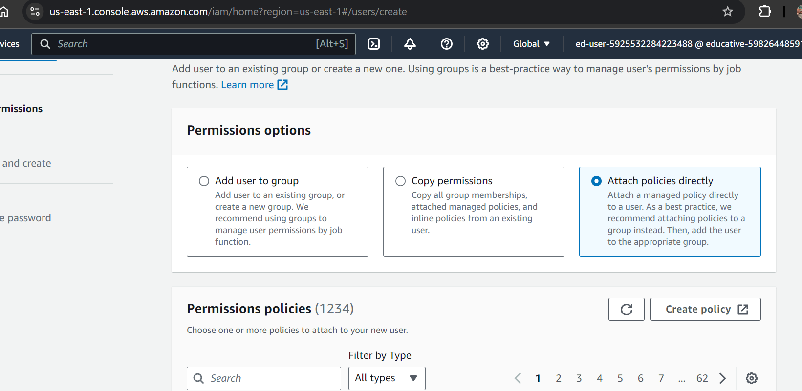
- Search for the IAMLabPolicy using the search bar in the “Permissions policies”.

- Select IAMLabPolicy and click the “Next” button.

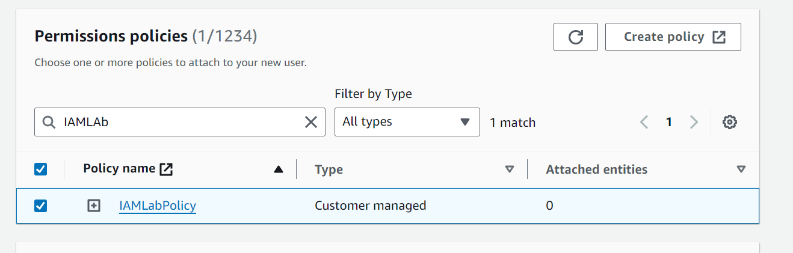

- On the “Review and create” page, click the “Create user” button.

- We’ll now see the “Console sign-in details.” Copy the “Console sign-in URL,” “User name,” and “Console password,” and keep them safe or download the credentials by clicking the “Download .csv file” button.

- Click the “Return to users list” button.

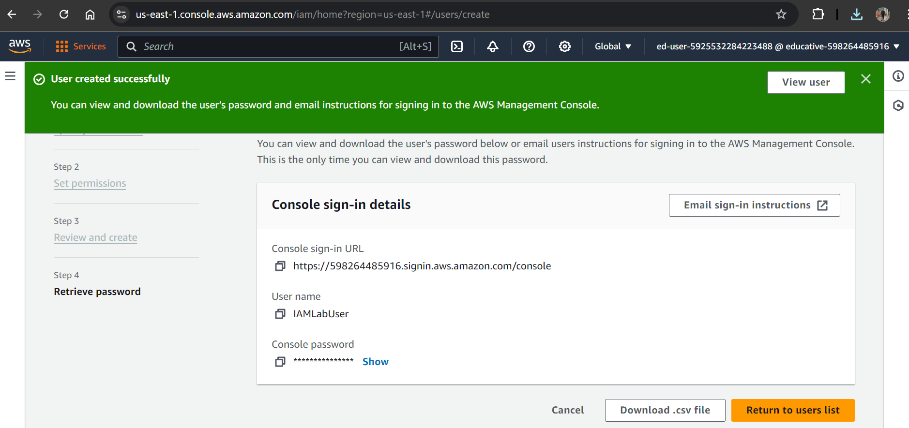

### Login using the new user
We’ve now created a new user IAMLabUser which has the IAMLabPolicy policy attached to it. Now, let’s log in as the new user we’ve just created. Follow the given steps to proceed:

- Open a new private window to log in as IAMLabUser without logging out from your current AWS session.

- Navigate to the “Console sign-in URL” you copied in the previous step. This will take you to the AWS Management Console sign-in page with the account ID already entered.

- Enter IAMLabUser for “IAM user name.”

- Enter the “Console password” you copied in the last step for “Password.”

- Click the “Sign in” button to log in to the AWS Management Console.

### Create an S3 Bucket

AWS Simple Storage Service (S3) is one of the storage services provided by AWS. S3 is commonly used to store data, including images, web application content, backups, logs, and more. Each S3 bucket has a globally unique name and is inaccessible to the public by default.

In this lab, we will create a bucket to store the contents of the web page. After the completion of this task, the provisioned infrastructure would be similar to the one shown in the figure below:

### Steps

- Open the AWS Management Console for “IAMLabUser.” Search “S3” on the AWS Management Console and click “S3” from the search results. This takes us to the S3 dashboard.

- Click the “Create bucket” button.

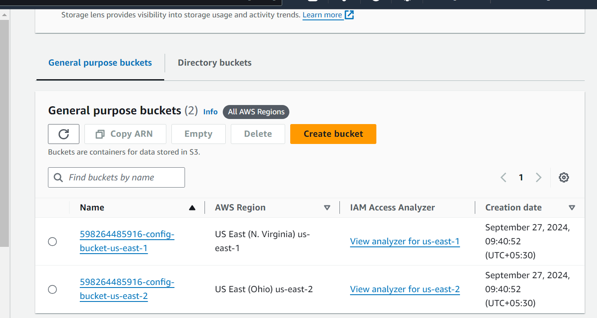
- In the general configuration tab, make sure that the “AWS Region” is set to “US East (N. Virginia) us-east-1”. If not, switch to the “N.Virgina” region using the drop-down menu on the top-right of the screen next to the user name.

- Enter a name for the bucket. For this lab, web-content-bucket should be the first letters of the bucket’s name. Append allowed characters with web-content-bucket to make the name globally unique.

- In the “Block Public Access settings for this bucket” section, uncheck the “Block all public access” option. We’ll define a policy to restrict access in the next task.

- Acknowledge the public access warning by checking it.

- Scroll down to the end of the page and click the “Create bucket” button. We’ll now be redirected to the S3 Buckets page

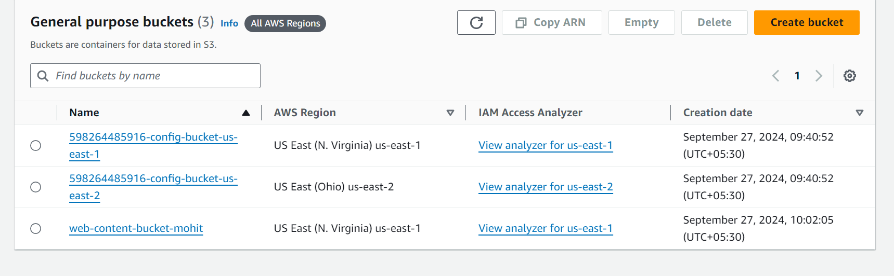

### Upload files to S3 Bucket

In this task, we’ll upload an image and index.html file to our S3 bucket. The infrastructure at the end of the task would look similar to the one given below:

#### steps
1. Search “S3” in the search bar to open the S3 dashboard. Click “Buckets” on the side bar to list the buckets.

2. Click the bucket name we’ve just created. We’ll be redirected to the bucket page.

3. On the “Objects” tab, click the “Upload” button. We’ll be redirected to the upload page.

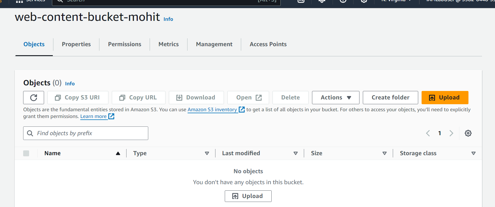

4. Click the “Add files” button in the “Files and folders” section.

5. Upload any image you want to display on your web page. You can also download the Educative’s logo. Click the “Upload” button. Close the success prompt to be redirected to the “Objects” tab, which lists the name of the uploaded image.

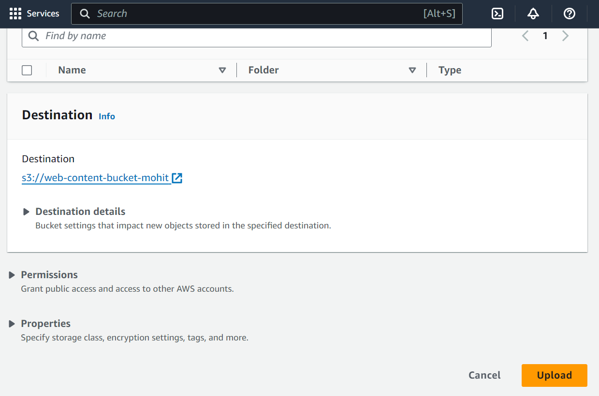

6. Here, click the name of your image. Copy the “Object URL” and save it.

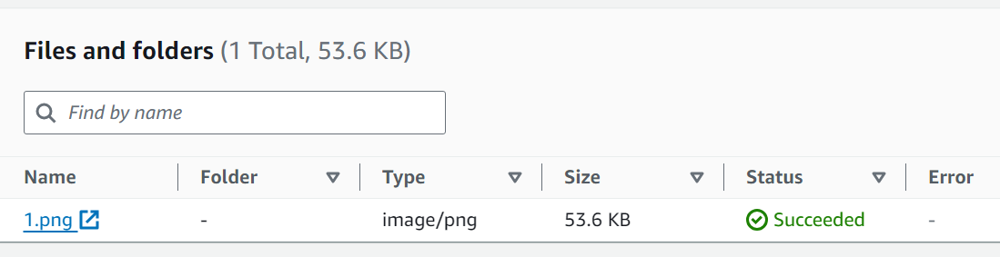
---
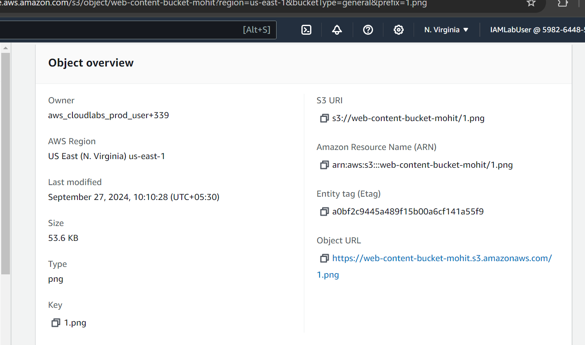
7. Next, download the HTML file and paste the Object URL into the HTML file.

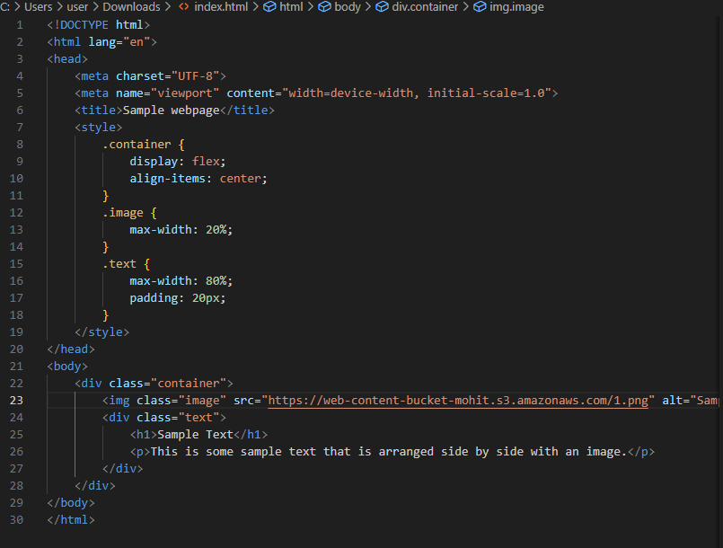

pasted in line 23

8. Upload this HTML file on the “Objects” tab.

With that, we’ve successfully uploaded a file and an image to our S3 bucket. However, this file isn’t publicly accessible at this point. Let’s verify this by accessing the file using the public URL.

- Select the index.html file we just uploaded from the “Objects” section and copy the URL listed below "Object URL." This is the publicly accessible URL for the file.

- Open a new browser tab and paste the URL in the search bar. We’ll see an access denied error. This is because the bucket contents are not publicly accessible at this point. In the previous task, we had allowed public access. However, we’ll have to add a bucket policy to manage access.

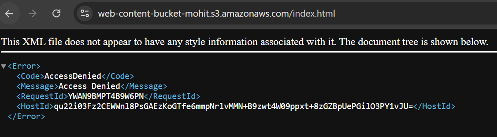

## Add a resource-based policy to the bucket
We can manage the access to our S3 bucket using resource-based policies. Their structure is similar to IAM policies discussed in the previous task except for the “Principal” element, which defines the IAM identity that can perform the action.

### steps

- Go back to the “Buckets” tab and click on your bucket’s name. Click the “Permissions” tab on the bucket page.

- Scroll down and click the “Edit” button in the “Bucket policy” section.

- Copy the policy from the code widget below and paste it into the policy editor window.

```json
{
    "Version": "2012-10-17",
    "Statement": [
        {
            "Sid": "BucketAccess",
            "Action": "s3:GetObject",
            "Effect": "Allow",
            "Resource": "<ARN>/*",
            "Principal": "*"
        }
    ]
}
```
- Replace  [ARN ] in line 8 with the Amazon Resource Name (ARN) of our bucket. You can find the ARN in properties or just above editor.

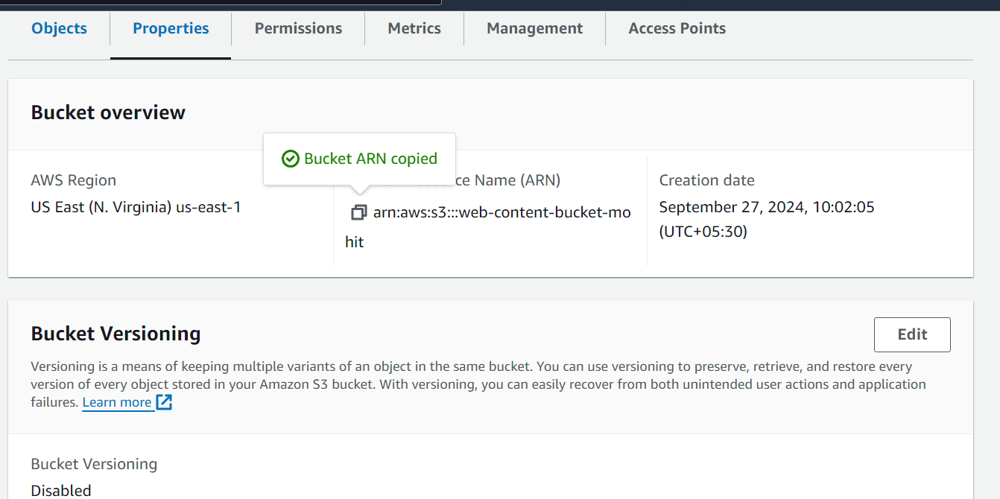

---
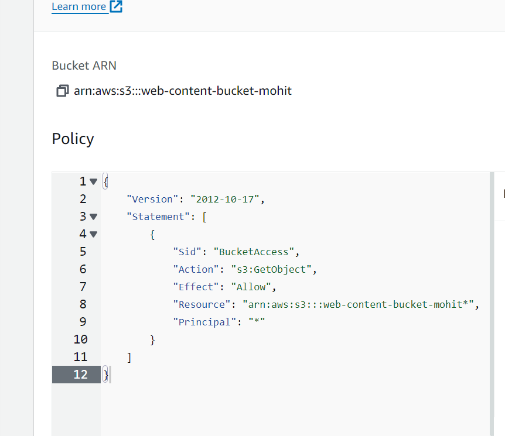

- Click the “Save changes” button.

### output:

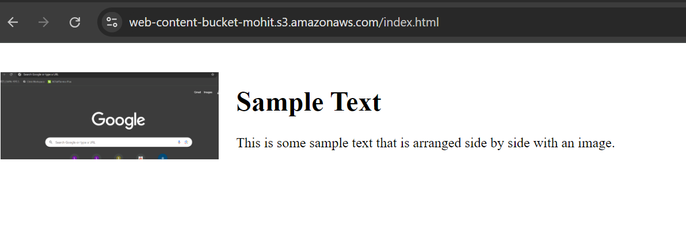

# Create Security Group

Amazon Elastic Cloud Compute (EC2) provides scalable computing services. Using EC2, we can deploy EC2 instances, which are essentially customizable (virtual) machines deployed to acquire on-demand, secure, and scalable hardware. There are several types of EC2 instances used for specific user requirements.

EC2 also provides support for multiple operating systems through Amazon machine images. Amazon Machine Images (AMI) store the basic components required for an operating system. AWS provides AMI options for Linux, Windows, Mac, etc. However, you can use your own AMI.

Security and access to an EC2 instance can be managed using security groups and key pairs. Security groups are rules that manage the inbound and outbound traffic for the instance. In simple terms, they can be considered a firewall for the instance. Similarly, key pairs consist of a private key stored on the local computer and a public key stored on the EC2 instance, which allows one to connect to an instance.

Furthermore, we can allow our EC2 instances to access other services using IAM roles. AWS Identity Access and Management (IAM) roles are AWS identities with an identity-based policy specifying their access. So far, this is similar to IAM users. However, what makes roles unique is that instead of being directly associated with someone, anyone can assume a role, including IAM users and AWS services. This gives them temporary credentials to access resources and services based on the policy.

In this task, we’ll create a security group to allow SSH and HTTP connections to the instance. Also, we’ll create an IAM role for the EC2 instance to allow it to access objects of the S3 bucket. The provisioned infrastructure would look similar to the one given below:

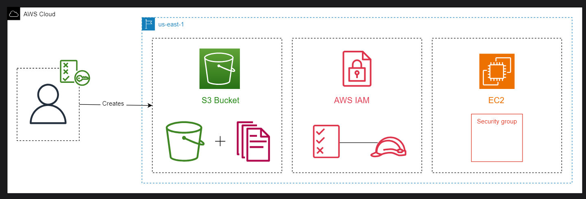

### Create a security group

- On the AWS Management Console, search for “EC2” and click the EC2 service from the search results. This takes us to the EC2 dashboard.

- In the sidebar,in network and security, click the “Security Groups” option under the “Network & Security” section.

- Click the “Create security group” button.

#### Follow these steps to configure the security group:

- Basic details

    - Enter web-app-security-group as the security group name.

    - Enter Security group for EC2 instance as the description.

    - Keep the default VPC under the “VPC” option.

- Inbound rules

    - Add the first inbound rule as follows:

        - Click the “Add rule” button under “Inbound rules.”

        - Select SSH as the type.

        - Enter Anywhere-IPv4 as the source.

    - Add the second inbound rule as follows:

        - Click the “Add rule” button under “Inbound rules.”

        - Select HTTP as the type.

        - Enter Anywhere-IPv4 as the source.

- Outbound rules

    - Keep the existing default rule, as we do not need to change or add outbound rules.

Once you finish the steps above, click the “Create security group” button.

We have successfully created a security group.

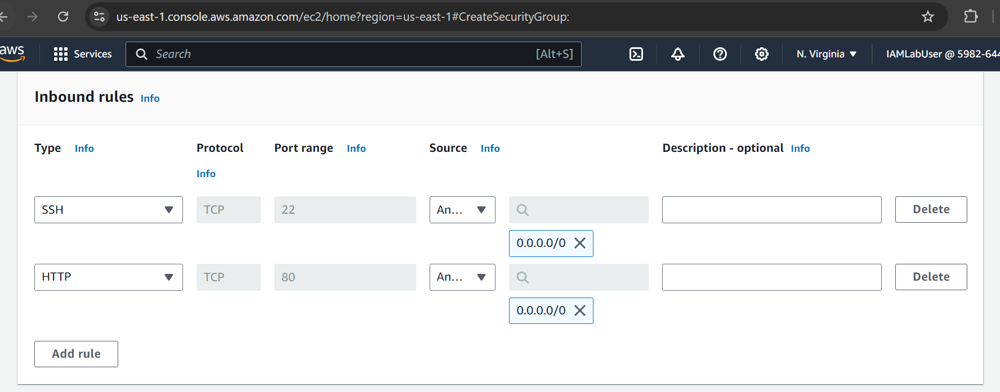

## Create an IAM role
We need an IAM role to allow our EC2 instance to access the bucket. For the role, we’ll use S3AccessPolicy. The policy is already created and defines basic permission to get the contents of an S3 bucket. Hence, if the EC2 instance assumes this role, it can access the bucket’s contents.

Follow the steps below to create an IAM role:

- On the AWS Management Console, search for “IAM” and select “IAM” from the search results. This takes us to the IAM dashboard.

- Click “Roles” under the “Access management” heading in the left menu bar.

- Click the “Create role” button.

    - For “Trusted entity type,” select “AWS service.”

    - Click the drop-down menu for “Use case” and select “EC2”.

    - Click the “Next” button.

- On the “Add permissions” page, search for S3AccessPolicy under the “Permissions policies” section.

- Select the S3AccessPolicy policy from the search results and click the “Next” button.

- Name the role AccessBucketRole.

- Scroll to the end of the page and click the “Create role” button.

# launch ec2

- Step 1: Add instance name and tags

    Set clab-instance as the name of the instance.

    For now, we can skip adding additional tags and proceed to the next step.

- Step 2: Choose Amazon Machine Image (AMI)
For this lab, we’ll use an Ubuntu-based image to launch the instance.

    In the “Quick Start” menu, select the “Ubuntu” image.

    Select the Ubuntu Server AMI 24.04 LTS (HVM), SSD Volume Type.

    Select the 64-bit (x86) architecture.

- Step 3: Choose an instance type

    An instance type combines various AWS resources like CPU, memory size, and storage that we want to attach to the instance according to our business needs.

    For this lab, we’ll use the t2.micro instance type, normally used for running inexpensive and general-purpose tasks.

    Select the t2.micro type from the list.

-   Step 4: Select key pairs

    From the “Key pair name” drop-down menu, select the “Proceed without a key pair (Not recommended)” option.

- Step 5: Configure network settings

    Select the “Select existing security group” option.

    From the security groups drop-down menu, select the web-app-security-group security group we previously created.

- Step 6: Configure storage

    Ensure that 8 GiB of gp3 storage is selected. We don’t need to add any new storage for this instance or modify the existing one. Leave everything at its default setting and proceed to the next step.

- Step 7: Configure advanced details
   -  IAM instance profile

    Click the drop-down menu and select “AccessBucketRole” to attach the IAM role.

    - User data
    
        The “user data” section is used during the bootstrapping process, which involves running a script on the instance on instance launch to install any required dependencies for the user on our server. Copy the following script and paste it into the “User data” textbox to launch a basic web server.

        ```bash
      
        sudo apt update && sudo apt install unzip
        curl "https://awscli.amazonaws.com/awscli-exe-linux-x86_64.zip" -o "awscliv2.zip" &&\
        unzip awscliv2.zip && sudo ./aws/install
        sudo apt -y install nginx
        sudo systemctl start nginx.service
        ```
        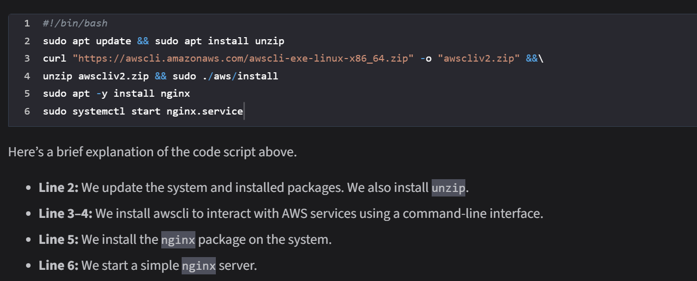
- Step 8: Launch instance
Review the settings for the new instance before clicking the “Launch instance” button to launch the instance.

    Finally, click “View all instances” to return to the “Instances” page. Within a few minutes, the status of our newly launched instance should automatically change to “Running.”        

# Deploy Web Application on EC2 instance

In this task, we’ll set up an application on the nginx server running on the EC2 instance. We’ll fetch and use the file from the S3 bucket. The provisioned architecture at the end of this task will be similar to the architecture diagram below:    

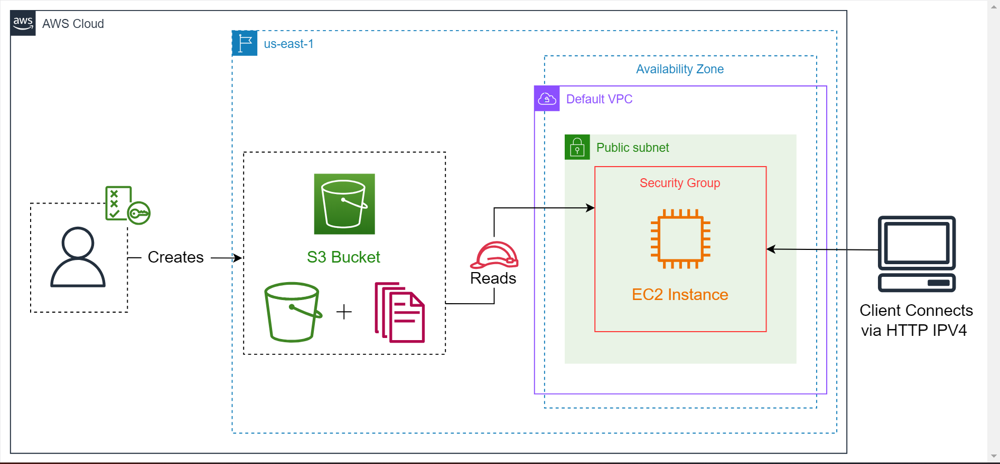

Select the instance clab-instance and click “Connect”. This will open the “Connect to instance” page. Here, select “Connect using EC2 Instance Connect” as the connection type. Keep the rest of the settings as it is, and click “Connect.” We’ll connect to the EC2 instance.

Check the status of the nginx server using the command given below.

```bash

sudo systemctl status nginx.service

```
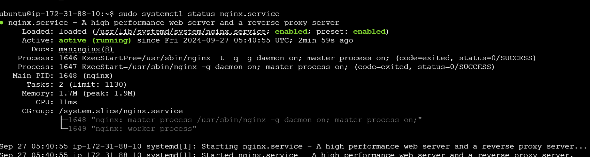

Move into the directory to var/www/html by typing the following commands.

```bash
cd /var/www/html
```

Next, we’ll copy the contents of the S3 bucket into the current directory with the command given below. Replace [YOUR_BUCKET_NAME] with the name of your S3 bucket.

```bash
sudo aws s3 cp s3://[YOUR_BUCKET_NAME]/index.html . 
```

The file index.html stored in the bucket is now copied to the directory.

Copy the “PublicIPs” mentioned below the CLI and open it in a new tab, but make sure to use HTTP and not HTTPS in the URL. You can now view your HTML in the web browser.
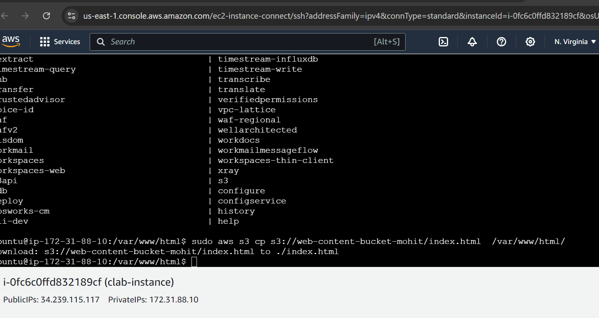

see public ip same as the ip entered on browser

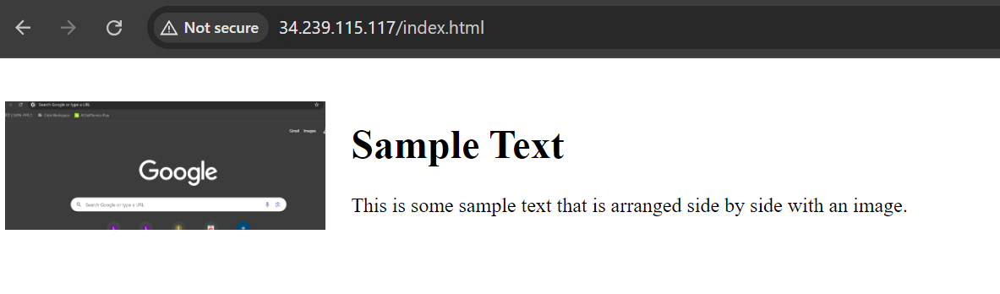

# What is Serverless Computing?

Serverless computing is an execution model that enables users to run their applications without setting up the servers. The cloud provider manages the allocation, scaling, and maintenance of computing resources. Serverless computing still requires servers. However, it spares developers the hassle of setting up the infrastructure for code execution.

## How does serverless computing work?

Serverless computing dynamically allocates the resources required for code execution at runtime. Function as a service (FaaS) is a subcategory of serverless commuting. It allows the developer to write their code as functions. These functions are triggered by some event. Once triggered, the cloud provider allocates the required compute resources and executes the function on the backend.

## Lambda functions
Some of the major cloud providers offer serverless computing. AWS offers a serverless and event-driven compute service called Lambda function. When a Lambda function is invoked, it creates a container with the required resources and executes the code in the container. The user only pays for the number of times the function is invoked and the time taken by the function to execute.

Lambda functions can be used to execute code in response to events, such as changes to data in an Amazon S3 bucket, updates to an Amazon DynamoDB table, or HTTP requests via Amazon API Gateway. They are frequently used to host static websites, process data streams, create serverless APIs, and more.

## Create a Lambda Function

In this task, we’ll create a Lambda function and create an IAM role to enable the function to access S3 objects. After the completion of this task, the provisioned infrastructure would be similar to the one shown in the figure below:

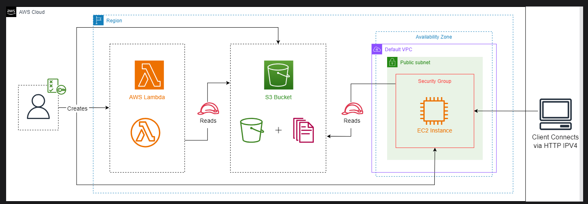

### Create IAM Role
Follow the steps below to create an IAM role for the lambda function:

- On the AWS Management Console, search for “IAM” and select “IAM” from the search results. This takes us to the IAM dashboard.

- Click “Roles” under the “Access management” heading in the left menu bar.

- Click the “Create role” button.

- For “Trusted entity type,” select “AWS service.”

- Click the drop-down menu for “Use case” and select “Lambda.”

- Click the “Next” button.

- On the “Add permissions” page, search for S3AccessPolicy under the “Permissions policies” section.

- Select the S3AccessPolicy policy from the search results and click the “Next” button.

- Name the role LambdaRole.

- Scroll to the end of the page and click the “Create role” button.

### Create Lambda function

- Open the AWS Management Console for “IAMLabUser.” Search for “Lambda” and select “Lambda” from the search results. This takes us to the Lambda dashboard.

- Click the “Create function” button.

- On the “Create function” page, select “Author from scratch.”

- Under the “Basic information” section, enter the following information:

- For “Function name,” enter WebPageFunction.

- For “Runtime,” choose “Python 3.11” from the drop-down list.

- For “Architecture,” select “x86_64” from the list.

- Our lambda function needs to access the bucket. Thus, we'll allow it to assume the LambdaRole created in the previous section. Click the “Change default execution role” label:

- For “Execution role,” select “Use an existing role” from the list.

- Select LambdaRole from the drop-down list.

- In the “Advanced settings” section, check the “Enable function URL” checkbox and select “NONE” as the Auth type.

- Leave the remaining settings as they are and click the “Create function” button at the end of the page.

#### Update function code
We’ve successfully created a Lambda function and attached an execution role. Now, it is time to update the function code to read a given file from the S3 bucket.

For that, under the “Code” tab on the Lambda function page, replace the code in the lambda_function.py file with the code in the widget below. Replace the value of the <[BUCKET-NAME]> variable on line 5 with the name of the S3 bucket you created earlier.

```python
import boto3

s3 = boto3.client('s3')
def lambda_handler(event, context):
    bucket_name = '<BUCKET-NAME>'
    index_file = 'index.html'
    
    try:
        response = s3.get_object(Bucket=bucket_name, Key=index_file)
        content = response['Body'].read().decode('utf-8')
        
        return {
            'statusCode': 200,
            'headers': {
                'Content-Type': 'text/html',
            },
            'body': content
        }
    except Exception as e:
        return {
            'statusCode': 500,
            'body': str(e)
        }
```

Let’s get an overview of the code given in the widget above:

Line 5: This is the name of our S3 bucket.

Line 6: This is the name of the file that we want to read.

Line 8: We implement a try block to get the contents of the bucket.

Line 9: We pass two parameters, bucket_name and index_file, to the get_object() function to retrieve an S3 object with the specified name.

Line 10: We read and decode the file contents.

Line 12–18: The file contents are returned as a string.

Line 19–23: We catch the exception and return error.

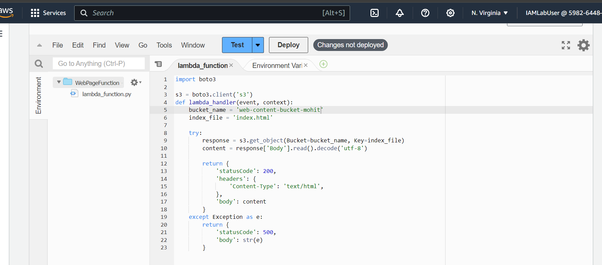

Now that we’ve updated the code of our Lambda function, we can go ahead and deploy it. Click the “Deploy” button to deploy the code changes.
 Next, copy the “Function URL” and paste it in your browser. The lambda function retrieves the index.html file from the S3 bucket and displays it on the browser. Thus, we’ve successfully hosted a serverless web application.

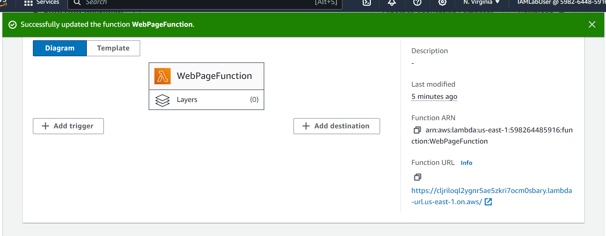

----

output:

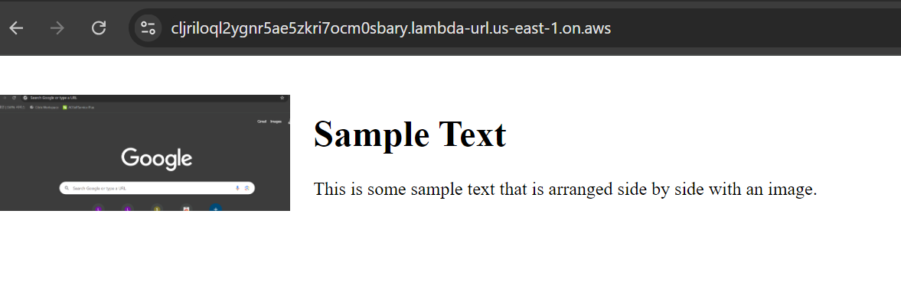

