## Steps
- Step 1 - Signup and get an AWS account. 
- Step 2 - Make sure you can access S3 and cloudfront (this will automatically happen if you are the root user of that account)

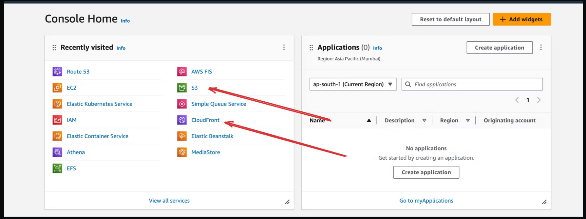


This approach will not work for frameworks that use Server side rendering (like Next.js)
This will work for basic React apps, HTML/CSS/JS apps

build react project on local

```bash
npm i -g serve
serve
```

- Step 3 - What are CDNs?

A CDN stands for Content Delivery Network. 
As the name suggests, it’s an optimal way for you to deliver content (mp4 files, jpgs and even HTML/CSS/JS files) to your users.

It is better than serving it from a VM/EC2 instances because of a few reasons - 

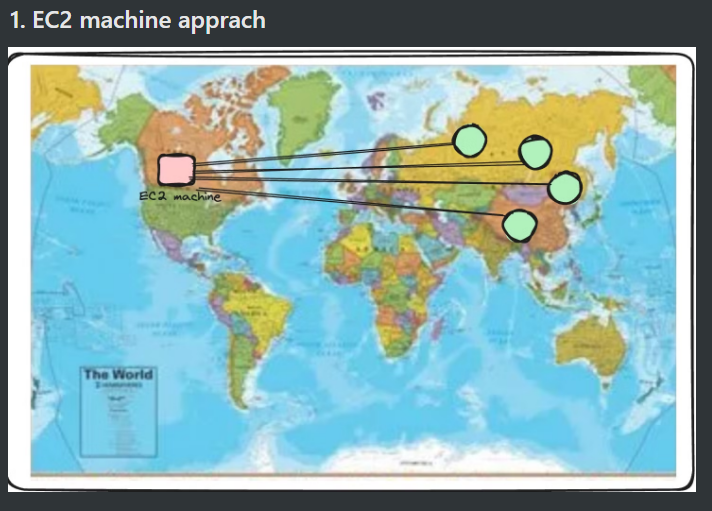

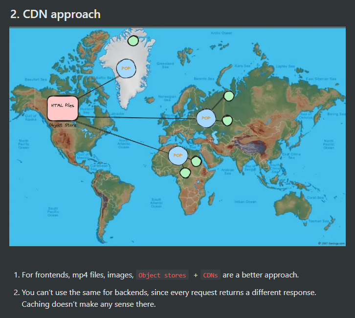

- Step 4 - Creating an object store in AWS

You can create a bucket in there. A bucket represents a logical place where you store all the files of a certain project.

- Step 5 - Upload the file bundle to S3

- Step 6 - Try accessing the website

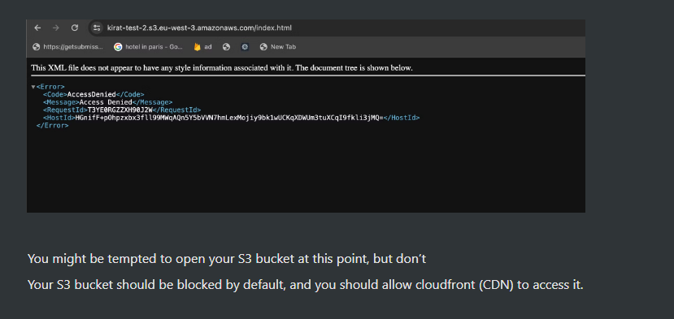

- Step 7 - Connecting Cloudfront
    - Step 1 - Create cloudfront distribution
Go to cloudfront and create a new distribution. A distribution here means you’re creating a place from where content can be distributed.

    - Step 2 - Select your S3 bucket as the source

    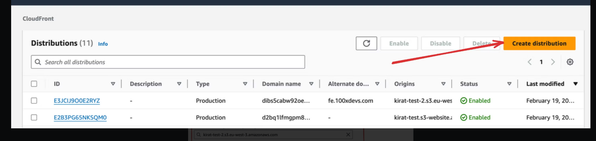

    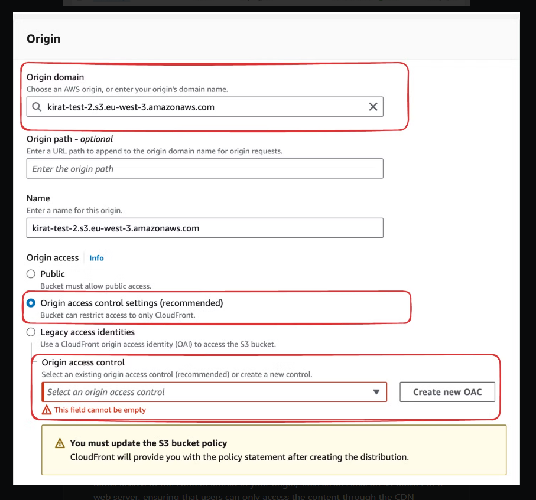

    
> Origin Access Control (OAC) is a feature in Cloudfront, which allows you to restrict direct access to the content stored in your origin, such as an Amazon S3 bucket or a web server, ensuring that users can only access the content through the CDN distribution and not by directly accessing the origin URL.


By the end of this, you should have a working cloudfront URL.
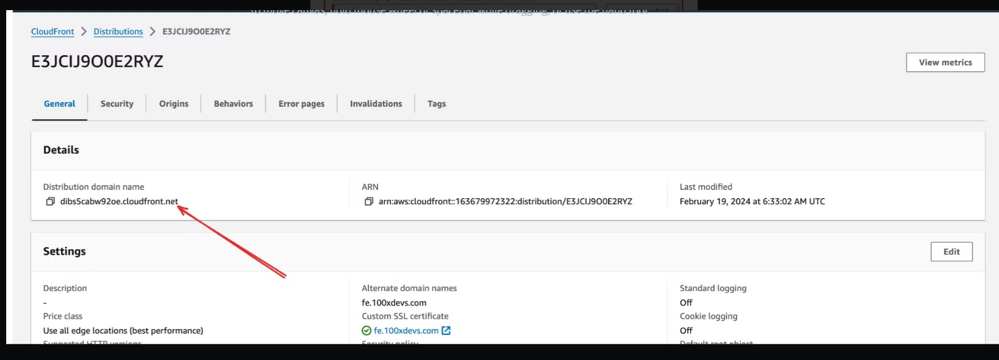

- Step 8 - Connect your own domain to it
    1. Select edit on the root page
    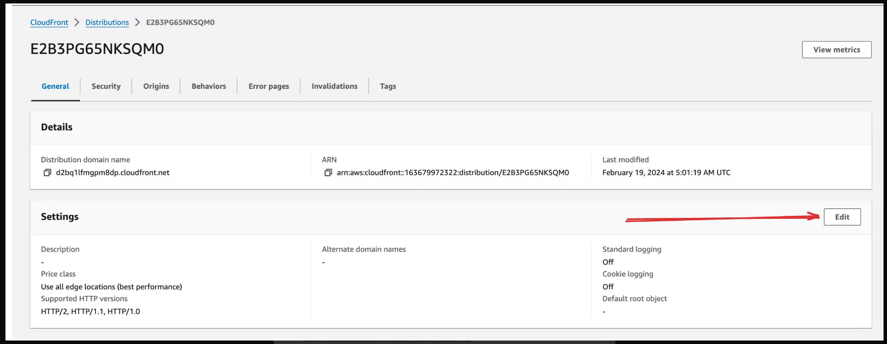

    2. Attach domain name
    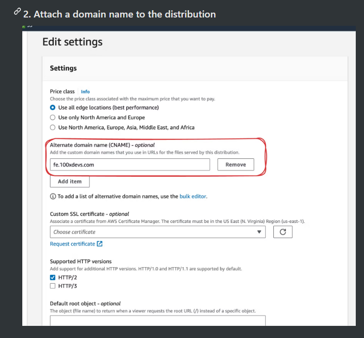

    3. create certificate
    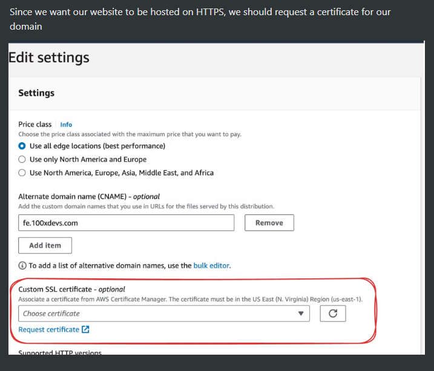

    4. Follow steps to create the certificate in the certificate manager

    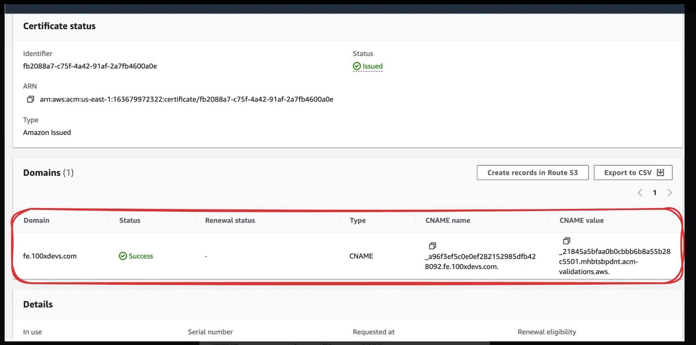

    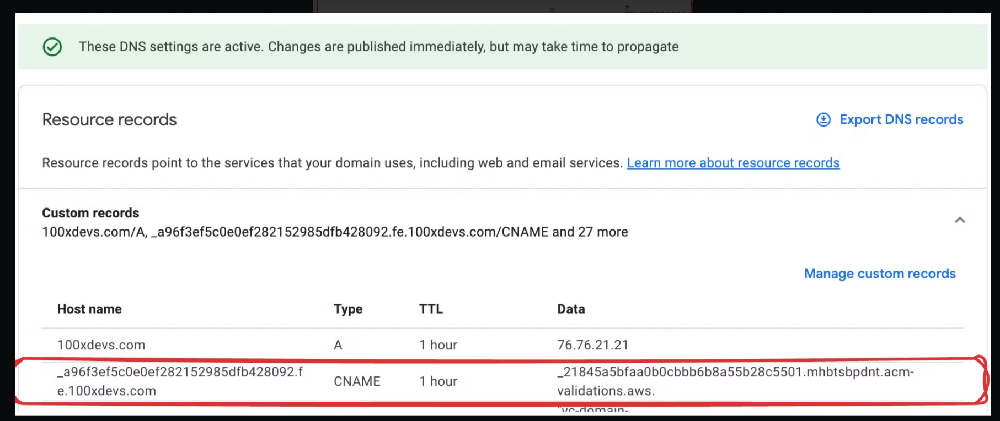

    5.  Add a CNAME record for the website to point to your cloudfront URL

    That’s it, you have a fully running react project hosted on HTTPS on a custom domain
- Step 9 - Error pages    
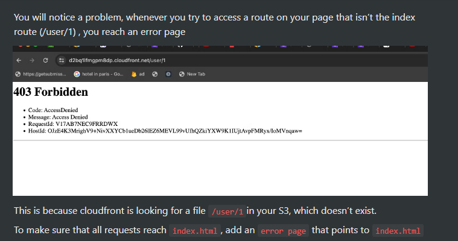
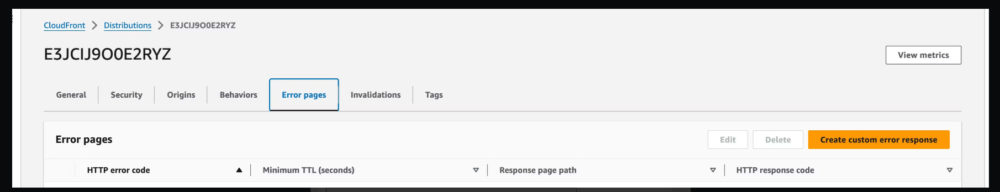

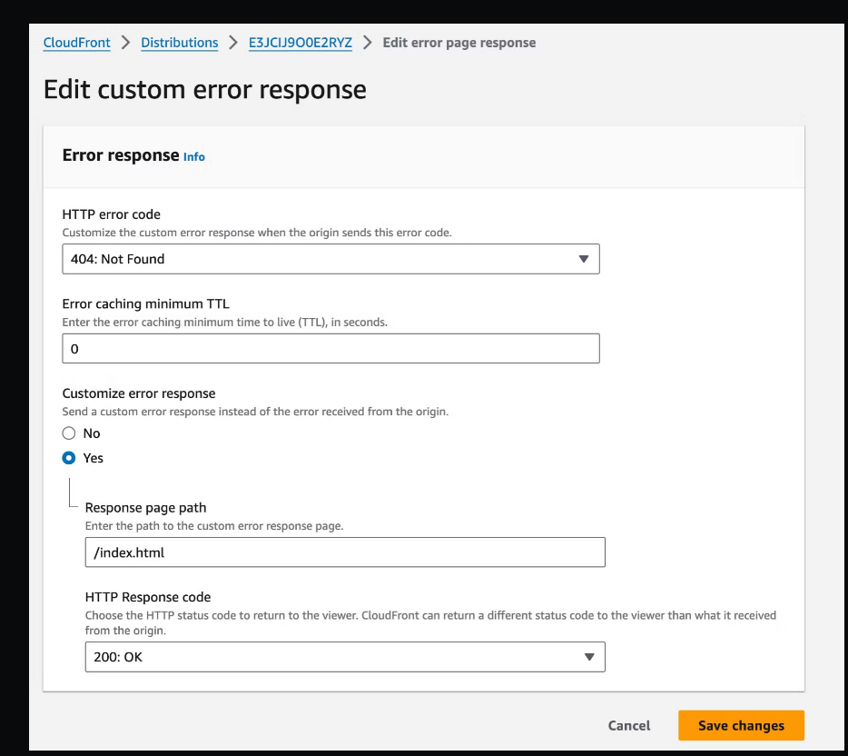