# Understanding Auto Scaling Group (ASG) in AWS

## Getting Started

Auto Scaling groups (ASG) is a collection of EC2 instances created on top of a launch template. EC2 auto-scaling service uses ASG to manage and auto-scale the instances. We can define a threshold for the number of instances in edge cases, like how many minimum and maximum instances must be there. ASG keeps track of instances in case they are terminated or launched.

EC2 security groups define the security settings for the instances that ASG will launch. It defines which virtual private cloud the instances will use and what protocols and rules should be allowed for inbound and outbound traffic.

EC2 launch templates define the configuration for auto-scaling groups. The launch template defines how an ASG should work, like the OS the instances will run on, their network settings, storage, firewall settings, and more.

## Create an EC2 Instance

In this task, we'll create an EC2 instance that runs in the AWS cloud. We'll also configure a NodeJS application on the newly created instance. By the end of this task, our infrastructure will be similar to the one shown in the figure below:

 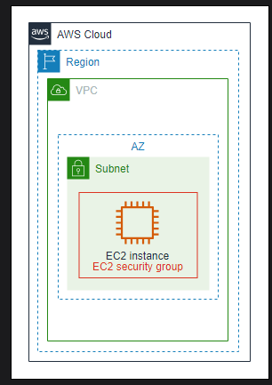

 Let’s create an instance by following the given steps:

- In the search bar of the AWS Management Console, search for “EC2” and select the “EC2” option from the results. This will take us to the EC2 dashboard.

- From the left panel, select “Instances” under “Instances” and click the “Launch instances” button.

- On the “Launch an instance” page, give a name to your instance.

- Under “Application and OS Images (Amazon Machine Image),” select “Quick Start,” and select “Amazon Linux” from the available OS. Selecting this expands a list of available machines. Ensure that the “Amazon Linux 2023 AMI” AMI with 64-bit (x86) architecture is selected.

- Under “Instance type,” select t2.micro.

- For “Key pair (login),” select the default value “Proceed without a key pair (Not recommended).”

- Click the “Edit” button in the “Network settings” section.

Here, we need to define the rules for the AWS security group, which controls traffic rules and acts like a virtual firewall for the instances.

- Leave the VPC options in their default state.

- Under “Firewall (security groups)”:

    - Set the name of the security group as my-educative-sg.

    - Set the description as “Security group for EC2 instance.”

    - We have one security group rule, which has already been added to the ssh “Type”. Keep it unchanged, and click the “Add security group rule” button.

    - For “Type,” select Custom TCP.

    - Enter 3000 in the “Port range” field.

    - For “Source,” select “Anywhere.”

    - For the “Description,” write “HTTP” because we define this rule for traffic coming from HTTP.

 >These are inbound rules we have defined
- Keep the remaining settings at default, and click the “Launch instance” button.

Once the instance is launched successfully, go to the “Instances” dashboard and wait until the value of the “Instance state” column becomes Running.

## Connect to EC2 instance and install Node.js
Follow the steps below:

- Select your instance and click the “Connect” button at the top of the page.

- Make sure that the username is ec2-user.

- Click the “Connect” button. It’ll open the EC2 instance terminal in a new tab.

At this stage, our instance is running and connected to the terminal. We’ll install a node server and run a simple application that returns the private IP address of our instance. Execute the following bash commands to install NodeJS on the running instance.

```bash
curl -o- https://raw.githubusercontent.com/nvm-sh/nvm/v0.38.0/install.sh | bash
. ~/.nvm/nvm.sh
nvm install 16
```

Now that NodeJS has been installed, execute the commands below to install the necessary modules for the NodeJS application:

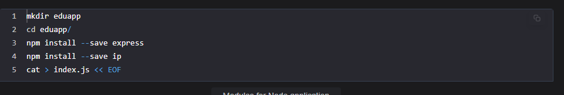

in text
```bash
mkdir eduapp
cd eduapp/
npm install --save express
npm install --save ip
cat > index.js << EOF
```

The last command in the script above will create a file named index.js. Now, copy the code from the widget below and paste it into the instance terminal.

```javascript
const express = require('express');
var ip = require("ip");

const app = express();
const PORT = process.env.PORT || 3000;

app.get('/',(req, res) => res.send(ip.address()));
app.listen(PORT, () => console.log('Server listening at port 3000'))
EOF
```

- Now, execute the node index.js command in the EC2 instance terminal. It will show the message Server listening at port 3000.

- At this stage, go to your instance and copy the public IPv4 address, paste it into a new browser tab, append :3000, and click “Enter.” It will display the private IPv4 address of your instance in the browser. You need to make sure to use HTTP (and not HTTPS) when connecting to the instance using the browser.

At this stage, we have successfully launched an EC2 instance and configured a NodeJS application.

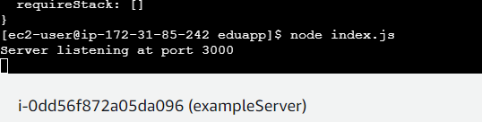

## Create a Launch Template

In this task, we’ll create an Amazon Machine Image (AMI) from our EC2 instance and create a launch template. The intuition is that we have an application running on an EC2 instance and want to auto scale the instances based on the application load. By the end of this task, our infrastructure will be similar to the one shown in the figure below:

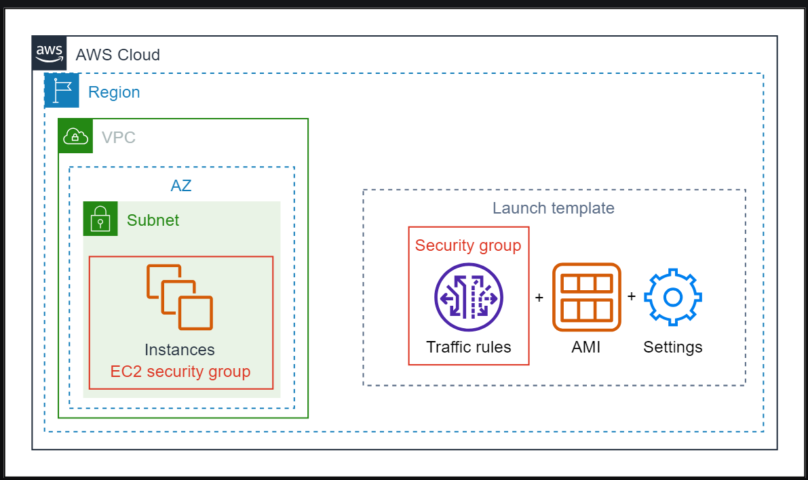

### Create an AMI
Follow the steps below to create an AMI:

- Under the EC2 service, click “Instances” from the left panel to open a list of instances.

- Right-click your instance, go to “Images and templates,” and click the “Create image” option. It’ll open the “Create image” page.

- Give educative-AMI name to the image, and click the “Create image” button.


It may take a while for the operation to complete, and we can check the status by selecting “AMIs” from the left panel. Wait for the value of the “Status” column to change from Pending to Available. We may need to refresh the list to see status updates.

can check AMI'S here

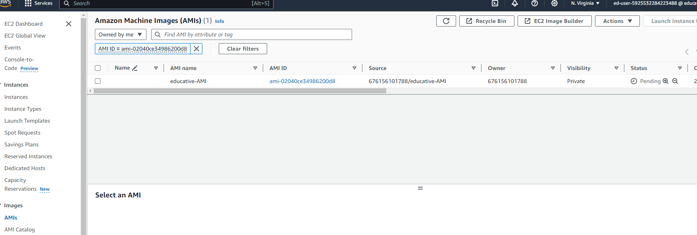


Let's terminate the running EC2 instance by following the steps below. We'll launch several other instances using the ASG later in the lab.

- On the EC2 "instances" page, select your instance.

- Click the "Instance state" drop-down button and select the "Terminate instance" button.

- Click the "Terminate" button on the confirmation pop-up.

### Create a launch template
The launch templates (successor of launch configurations) define configuration settings for the EC2 instances. Launch templates support versioning, and we can have multiple versions of the same template. This can help us define a base template and extend its functionality as required.

Now that we’ve successfully created an EC2 instance and AMI, let’s create a launch template by following the steps below:

- Click “Launch Templates” from the sidebar under “Instances.”

- Click the “Create launch template” button to open the “Create launch template” page.

- Set the name of the template as educative-launch-template.

- Set the description of the launch template version as “Launch template for ASG cloud lab.”

- Check the statement under the “Auto Scaling guidance” option.

- Under “Application and OS Images (Amazon Machine Image),” select “My AMIs.” Choose the AMI you created earlier.

- Under “Instance type,” select t2.micro.

- For “Firewall (security groups),” while “Select existing security group” is selected, search for my-educative-sg under “Security groups” and select it.

- Keep the remaining settings at default, and click the “Create launch template” button

## Create an Auto Scaling Group

In this task, we’ll create an ASG using our launch template. By the end of this task, our infrastructure will be similar to the one shown in the figure below.

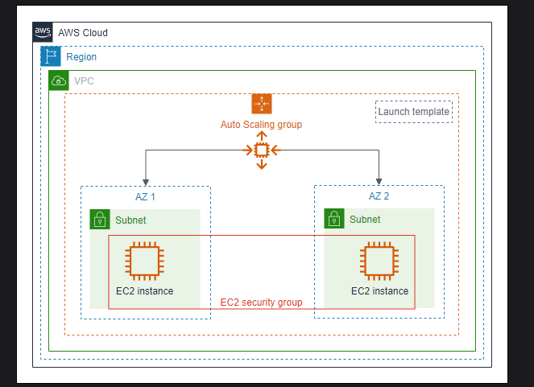

Under the EC2 service, select “Auto Scaling Groups” from the sidebar under “Auto Scaling.” Click the orange “Create Auto Scaling group” button.

>Note: You need to make sure that there are no running EC2 instances at this stage.

### Choose the launch template or configuration
- Set the name of the ASG as my-educative-asg.

- Under “Launch template,” select the educative-launch-template template we created earlier.

- Scroll down and click “Next” to proceed to the next step.

### Choose instance launch options
- Under “Availability Zones and subnets,” select all available zones.

- Scroll down and click “Next” to proceed to the next step.

### Configure advanced options
This step allows us to configure load balancing and health checks on your ASG. We can skip this step for this lab. Leave the values at their default settings. Click “Next” to proceed to the next step.

### Configure group size and scaling policies
This step allows us to configure the group size and scaling policies for your ASG. EC2 auto-scaling offers multiple scaling policies: manual scaling, dynamic scaling, predictive scaling, and scheduled scaling. The scope of this lab is confined to manual and “Target tracking scaling” policies. Let’s define the group size and scaling policies by following the steps given below:

- Under the “Group size” section, assign 1 to the “Desired capacity” field.

- Under the “Scaling” section, assign 1 to the “Min desired capacity” field and 2 to the “Max desired capacity” field. Make sure to add the same values as defined. Otherwise, the ASG will not launch.

- For the “Automatic scaling” option, select the “Target tracking scaling policy” option.

- Choose “Average CPU utilization” as the metric type.

- Keep the “Target value” at 20 and 60 seconds for the instances before they become a part of the metric.

- Click the “Skip to review” button to skip the next few steps.

### Review
Here, you can review the settings of the ASG before finally creating it. Scroll to the end and click the “Create Auto Scaling group” button.

Congratulations! You’ve successfully created your ASG!

## Verifying and Testing ASG Behavior

In this task, we’ll see how our Auto Scaling group will behave in the following two scenarios:

- When an instance fails or gets terminated.

- When the CPU utilization of our instance exceeds the threshold of 20 percent

### Verifying ASG behavior
Follow the steps below to verify the ASG's behavior:

- In the ASG dashboard, select the newly created ASG. It’ll open a panel at the bottom of the page. The first tab shows the details of the Auto Scaling Group.

- Click the “Activity” tab, and scroll to the “Activity history” section. Here, one instance is available (based on the desired number of instances). The status of this instance should be PreInService initially, and once the instances are launched, it’ll change to Successful.

- Under the “Instance management” tab, the “Health status” column shows Healthy once the instances are ready to receive traffic.

- Click “Instances” under “Instances” from the left menu panel.

- On the “Instances” page, you’ll see a new instance without any name with “Instance state” Running and the “Status check” column showing 2/2 checks passed.

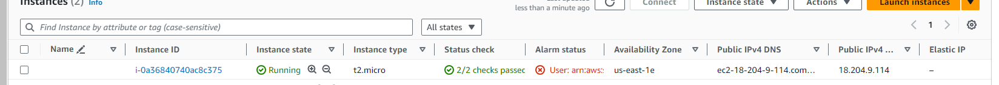
> Note: You have to wait until the instance passes both checks and becomes running.

- Click the checkbox of the new instance, and click the “Connect” button at the top of the page.

- On the “Connect to instance” page, write ec2-user in the text field of the “user name,” and click the “Connect” button. Once the EC2 instance terminal is connected, run the following commands and you’ll see that the node server we installed on the first EC2 instance is also accessible from this instance.

```bash
cd eduapp
node index.js 
# Server listening at port 3000
```
- On the “Instances” page, under the “Details” tab of the instance, copy the public IPv4 address of the instance and paste it into a new tab of the browser. Append :3000, and hit enter. Make sure that you access the IPv4 address using HTTP at port 3000. It’ll display the private IPv4 address of the instance in the browser.

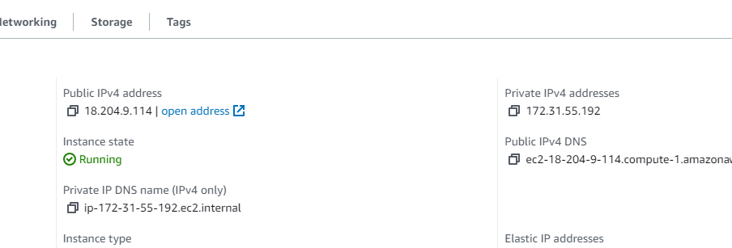

output:

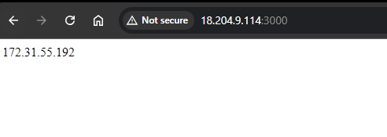

>Note: You can also use the EC2 “User Data” to run commands on your instance at launch.

### Testing case 1: Terminate an instance to mimic instance failure
We have verified that our instance is working properly. Now, let’s see what happens if an instance becomes faulty.

- On the “Instances” dashboard, select the instance created by the ASG.

- From the “Instance state” drop-down menu, select “Terminate instance.” In the pop-up that shows, click the “Terminate” button, and in a few minutes, the status of the “Instance state” column of the instance should change to “Terminated.” The public IPv4 address for this instance has also been removed.

After a few minutes, a new instance will be up and running automatically, and you can run the node server on this instance as well.

### Let’s check the behavior of our ASG.

Go to the dashboard of Auto Scaling Groups, click your ASG, and click the “Activity” tab. Under the “Activity history” section, there are three entries now. The new two entries show the termination of an instance and the launching of a new instance in its place.

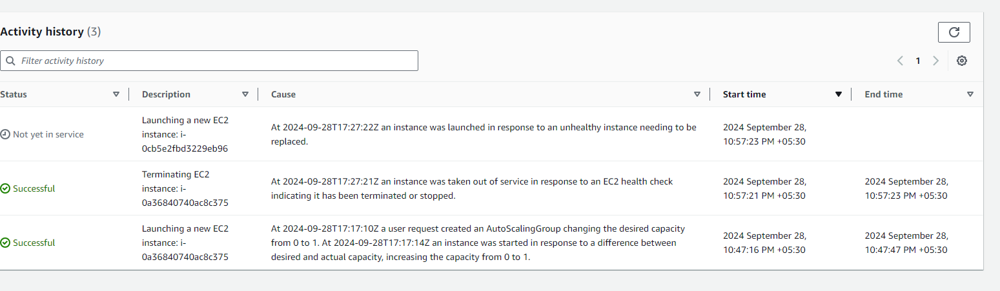

### Testing case 2: CPU utilization exceeds the threshold
We’ll use the stress utility to exhaust the CPU utilization of our instance and see what ASG will do in this case.

- Connect to the instance created by the ASG. Once the EC2 instance terminal is connected, execute the following commands to install stress and add load to the instance.
```bash
sudo yum install stress -y
#Stress the CPU with four worker threads for 320 seconds
sudo stress --cpu 4 --timeout 320
```

The first command installs the epel repository, the second installs the stress, and the third command starts 4 worker threads.

After a few minutes, you’ll notice that another instance is running. In our case, the number of new instances depends on the maximum number of instances defined during the creation of ASG.

Let’s monitor the CPU utilization under our Auto Scaling group.

- Go to the Auto Scaling groups dashboard, click your ASG, click the “Monitoring” tab, and click the “EC2” tab. The first graph shows the CPU utilization. You’ll see a spike in the graph. ASG observes that CPU utilization goes above 20 percent and launches the instances as required.

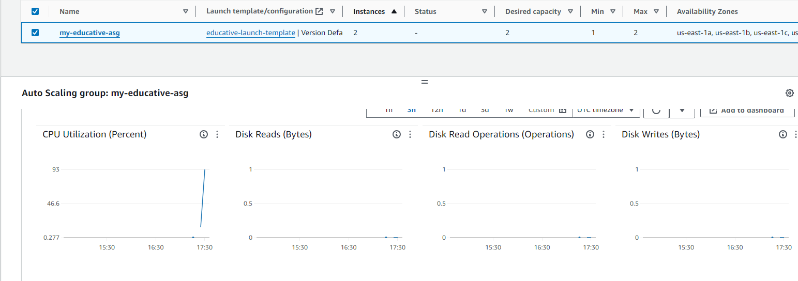


>Note: Keep refreshing the pages while observing the behavior of instances and CPU utilization.

After 320 seconds, when the stress decreases, and the utilization becomes normal, ASG terminates the instance launched automatically. ASG keeps the instances running for some time before they are terminated.

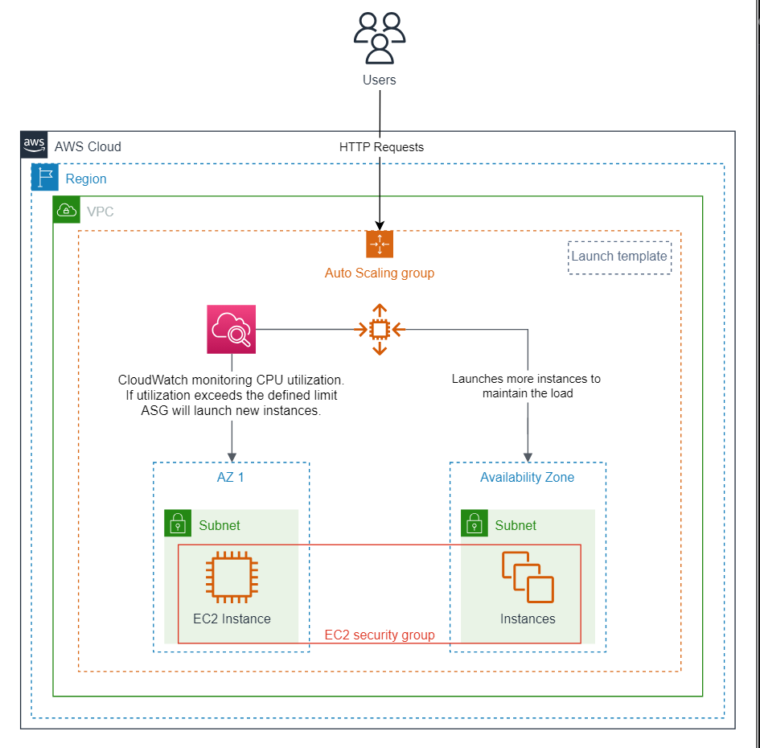

## Key takeaways
- Auto Scaling groups (ASG) are very useful in managing the resources according to your needs. You must have detailed knowledge about the resources your application requires to work properly in different scenarios.

- It helps you scale your application automatically; you don’t need to be there if anything goes wrong.

- ASG makes sure that you always have the desired number of instances running for your application and in the worst-case scenario, the minimum number of instances are available.

- If you have an application running on an instance, you can define an ASG to replicate the application in different zones of the regions. This is a one-time configuration, and ASG will take care of everything. This can save a significant amount of time in deploying real-time applications.

## Clean Up

Now that we’ve created and tested our ASG, we’ll clean up the resources we’ve created in this lab.

### Delete Auto Scaling group
- On the ASG dashboard, select the my-educative-asg ASG, click the “Actions” button, and select the “Delete” option.

- Type “delete” in the text field in the pop-up and click the “Delete” button.

- There will be a loading sign against the name of the ASG, and the “Status” column will show Deleting. The values in the “Desired capacity,” “Min,” and “Max” columns will become 0. After a couple of minutes, the group will be deleted.

>Note: Once the ASG is deleted, all running EC2 instances within the group will be terminated. We must wait for the instances to be terminated before deleting the security group.

### Delete launch template
- Navigate to “Launch Templates” from the left panel, and select the educative-launch-template template.

- From the “Actions” drop-down menu, select “Delete template.”

- Type “Delete” in the text field on the confirmation pop-up, and click the “Delete” button.

### Delete AMI
- From the left panel, select “AMIs” under "Images."

- Select educative-AMI, and click the “Actions” button at the top of the page.

- Click the “Deregister AMI,” and confirm your action by clicking the “Deregister AMI” button.

### Delete security group
- From the left menu panel, click “Security Groups” under “Network & Security.”

- Select the my-educative-sg group we created earlier, and from the “Actions” drop-down menu, select “Delete security groups.”

- Confirm your action in the pop-up by clicking the “Delete” button.