# Getting Started with AWS Key Management Service (KMS)

Amazon Web Services (AWS) Key Management System (KMS) is a security service used to create and manage cryptographic keys used in data encryption. It can be used to encrypt data outside of AWS and data stored within AWS by databases and storage services provided by AWS. It can help us secure our data and ensures compliance with industry standards.

## Create a Customer managed key

A KMS key is a root key used to perform all KMS-related operations within AWS. We need a KMS key to encrypt data within AWS and to create other keys that can be used to encrypt data outside of AWS. There are two types of KMS keys, which are as follows:

- AWS-managed keys: These are created and managed by AWS automatically. Users have limited control over the configuration of these keys.

- Customer-managed keys: These are created and managed by AWS users, and they have complete control over the configuration of these keys. These keys can either be symmetric or asymmetric in nature.

 In this lab, we’ll create and use a symmetric customer managed key for all AWS KMS-related operations. As discussed earlier, the first step to using AWS KMS is to create a KMS key, so let’s start by creating a customer managed key in this task. By the end of this task, the architecture diagram will be as follows:

 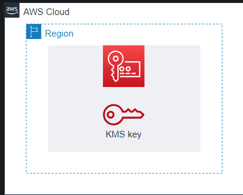

 ### Steps
 Follow the steps below to create a customer-managed key:

- Search for “Key Management Service” using the AWS Console search bar and select “Key Management Service” from the search result.

- Open the sidebar menu on the left side and select “Customer-managed keys” from it.

- Click the “Create key” button.

- Click the “Advanced options” to open the drop-down menu associated with it and ensure that the following options are selected on the “Configure key” page:

- Key type: “Symmetric” (Keys must be symmetric if we want to use the key with other AWS services)

- Key usage: “Encrypt and decrypt” (Allows us to perform encryption and decryption using this key)

- Key material origin: “KMS - recommended” (Specifies the key material for the key)

- Regionality: “Single-region key” (Keys can also be multi-region, useable in multiple regions)

- Click the “Next” button to go to the “Add labels” page.

- Provide myKey as the key alias and click the “Next” button.

- Now we’ll select the admins for this key. For the time being, we only want the current account to be added as the admin. To do that, select the user whose username starts with ed-user and click the “Next” button.

- We’ll select the users authorized to use this key on this page. Similar to the previous step, select the user whose username starts with ed-user and click the “Next” button to go to the next page.

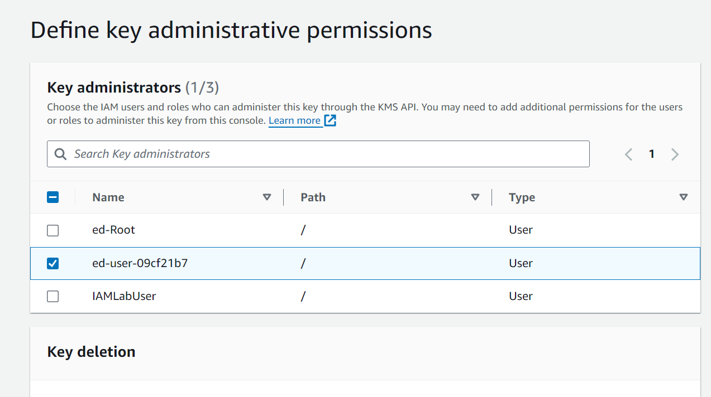

>Note: The last two steps shape the key policy attached with the key. This policy dictates which entities have permissions related to this key. We'll look at the key policy in the later stages of this lab.

- Review the configurations of the key. We’ll also be able to see the key policy in the last section of this page. Click the “Finish” button to complete the process.

## Generate a Data Key

We generated the required KMS key in the last task, and now we’ll learn how to encrypt data using KMS keys. Even though a KMS key can be used to encrypt data, it can encrypt only up to 4 KB of data and cannot be exported or used outside of AWS. This is because the basic operation of KMS keys is not to encrypt data but to encrypt passwords and other encryption keys.

To encrypt data, we have data keys. These keys are generated using KMS keys and can be exported from AWS for external use. In this task, we’ll generate data keys using the KMS key. By the end of this task, the architecture diagram will be as follows:

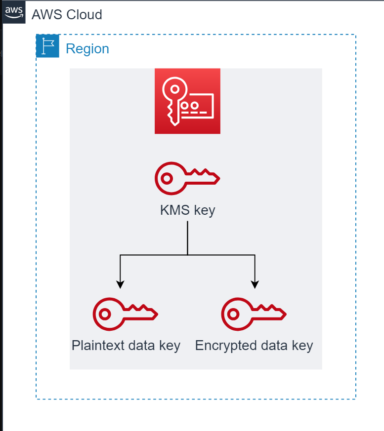

### Fetch the ARN of the KMS key
Data keys can’t be generated using the AWS Console. To generate data keys, we need to use the AWS CLI or AWS SDKs. But before we do that, we need the Amazon Resource Name (ARN) of the KMS key we generated in the previous task. Follow these simple steps to get the ARN of the KMS key:

- On the “Customer-managed keys” page, click the “myKey” alias listed in the list of keys.

- Copy the “ARN” written in the “General configuration” section. Also, store it somewhere safe because we’ll need it in the upcoming tasks.

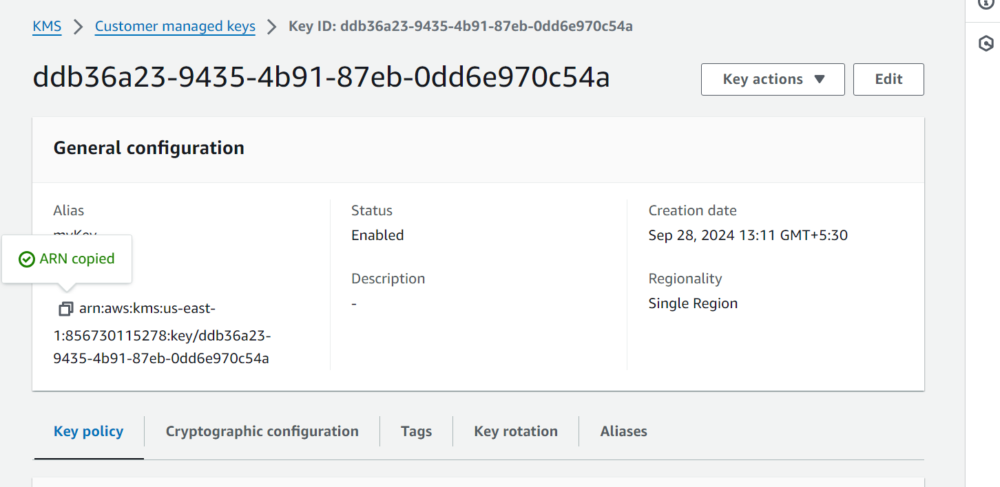

### Create data keys
Now that we have our KMS key ARN, let’s generate the data keys using the AWS SDK. The code below uses the KMS key to create data keys and then print the newly generated keys. Replace the <[CMK_Key]> in line 14 with the ARN of the KMS key, and then click the “Run” button to generate the data keys.

here we have put access key and secret key which is used by SDk to authorize 
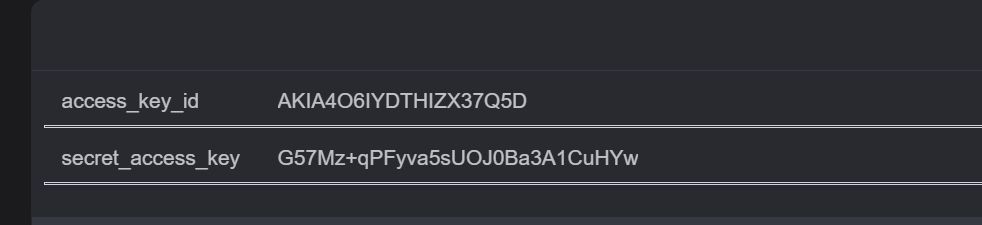
``` javascript
// Import the required packages
const { KMSClient, GenerateDataKeyCommand } = require("@aws-sdk/client-kms");

// Set the KMS client
const kmsClient = new KMSClient({
  region: 'us-east-1',
  credentials: {
    accessKeyId: '<keyid>',
    secretAccessKey: '<secret key>'
  }
});

// Define the Customer managed key (CMK) ARN
const cmkArn = '<CMK_Key>';

// Define the desired key spec
const keySpec = 'AES_256';

// Function to convert uint8Array to hexadecimal form
function uint8ArrayToHex(uint8Array) {
  return Array.from(uint8Array, byte => byte.toString(16).padStart(2, '0')).join('');
}

// Function to create a data key using KMS
async function createDataKey() {
  try {
    // Generate the data key using the specified CMK and key spec
    const response = await kmsClient.send(new GenerateDataKeyCommand({
      KeyId: cmkArn,
      KeySpec: keySpec
    }));

    // Extract the plaintext and ciphertext data keys from the response
    const plaintextDataKey = response.Plaintext;
    const encryptedDataKey = response.CiphertextBlob;

    console.log("Data key created successfully:");
    console.log("Plaintext Data Key:", uint8ArrayToHex(plaintextDataKey));
    console.log("Encrypted Data Key:", uint8ArrayToHex(encryptedDataKey));
  } catch (err) {
    console.error("Error creating data key:", err);
  }
}

// Call the function to generate and print the data key
createDataKey();
```

```text
Output: 
Data key created successfully:
Plaintext Data Key: 044e28c891aa585244aa15f478e7f9b198f84e2db0541f2fa06af4e2a0955c61
Encrypted Data Key: 01020300781b246a72782122be6712ed666938bb1430f97d73b572311722fcf871885189f9014db31cb324b75ca923840d13a9d8cf160000007e307c06092a864886f70d010706a06f306d020100306806092a864886f70d010701301e060960864801650304012e3011040c4bcdaa0ac0f78e3b1722b47a020110803b3f699a94cd415b63b745be13bc9c37e6b7aa9c9f5e48ffb01bdfaceb323b47f3c6bcc7c0c4ed69884fca32d2d7eafc4b7c9600f2beebed6f2113c6

```

The createDataKey() function in lines 25–43 uses the GenerateDataKeyCommand method in line 28 to generate the data keys, converts the data key from an integer array format to readable hexadecimal format, and then prints the keys on the console.

We’ll get a plain data key and an encrypted data key in the output. Save these keys somewhere safe because they’ll be used in the next tasks.

## Encrypt Data Using Data Key

In a typical workflow, a plaintext key is used for encryption, and once the data is encrypted, the plaintext key is securely deleted, while the encrypted data key is retained for decryption purposes. In this task, we’ll use the plaintext data key we generated in the previous task to encrypt some text.

By the end of this task, the architecture diagram will be as follows:

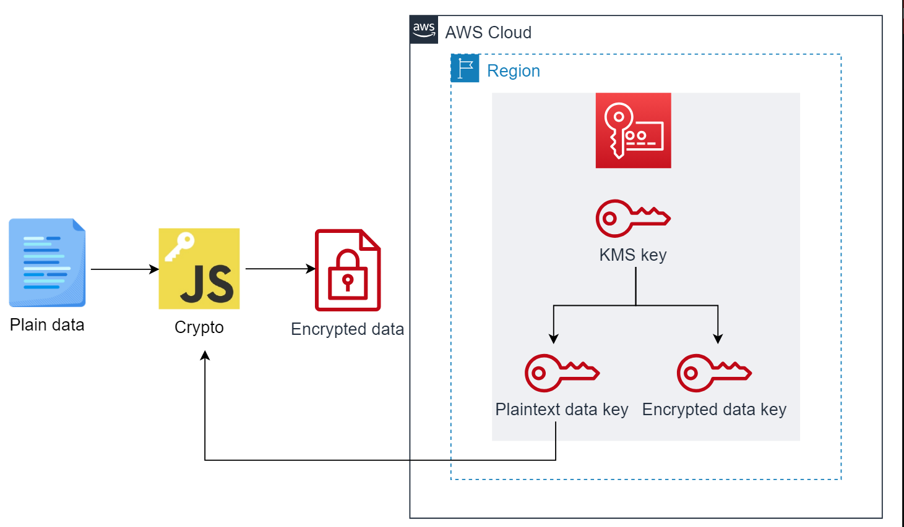

The code below uses the data key we generated previously to encrypt some text. Replace the <[plain data key]> in line 4 with the data key we saved in the previous task and click the “Run” button to get the encrypted version of the text in line 7.

```javascript
const crypto = require('crypto');

// Our plaintext data key as a Uint8Array (32 bytes)
const plaintextDataKey = '<plain data key>';

// Data to be encrypted (example)
const dataToEncrypt = 'Hello, this is my sensitive data.';

// Create an AES-256 cipher with the plaintext data key
const cipher = crypto.createCipher('aes-256-ecb', plaintextDataKey);

// Encrypt the data
let encryptedData = cipher.update(dataToEncrypt, 'utf8', 'base64');
encryptedData += cipher.final('base64');

console.log("Encrypted Data:", encryptedData);
```

```text
Output

Encrypted Data: URVttKe0BmFvvFuvLZJKAEw0nQllDST5GfF+WsoD3HuYOpxY8QPWZnt7NEJ40hWz
```

To encrypt the data, we use crypto. It uses the data key for the encryption. A cipher key is created by crypto in line 10 using the data key we provided. We then use that cipher key in lines 13–14 to encrypt our data.

We’ll get the encrypted version of the text as the output. Store it somewhere safe because it will be used in an upcoming task.

## Decrypt the Data Key

As discussed earlier, in a typical workflow, a plaintext key is used for encryption, and once the data is encrypted, the plaintext key is securely deleted, while the encrypted data key is retained for decryption purposes. Let’s look at the data encryption process in detail.

- For data at rest: This refers to encrypting the data that’s to be stored. For this type of encryption, we delete the plaintext data key after encrypting our data so that in case our system gets compromised, the attacker only gets the encrypted data and encrypted key. 

    Because the attacker won’t have access to our customer managed key, there’s no way for them to get their hands on the plaintext key that was used for encryption. So even though they got their hands on the encrypted data, it’s useless to them.

  In case we want to decrypt the encrypted data, we’ll first decrypt the key to get a plaintext key and then use that key to decrypt our data.

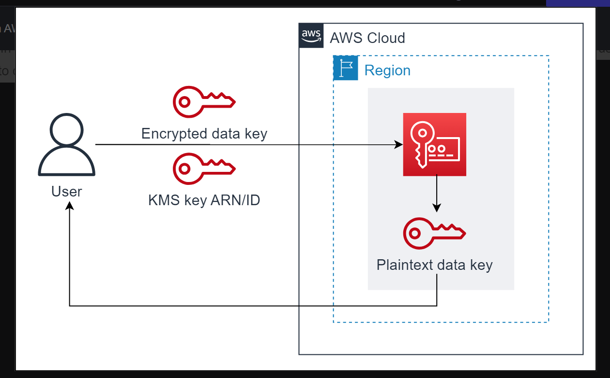

- For data to be transmitted: This refers to encrypting the data that’s to be transmitted. For this type of encryption, we send the encrypted data and encrypted data key to the receiver. Now, even if our message gets intercepted by an attacker, they’ll only have access to the encrypted data and encrypted data key. Therefore, just like in the previous case, they won’t be able to decrypt the key and our encrypted data will remain in encrypted form.

  If the receiver receives the message and wants to decrypt it, they’ll use our customer managed key to decrypt the key and then use the resultant plaintext key to decrypt the message.

>Note: The KMS key has a key policy that specifies the users allowed to use it and also the operations those users are allowed to perform using that key. Only the administrator of the key can change that policy which makes use of a KMS key by multiple AWS users secure. so thats why that key cant be used by any other person who don't have authorization!

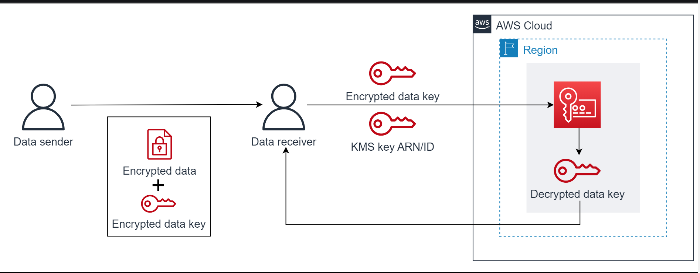


Now, let’s look at how we can decrypt the data key. The code below uses the AWS SDK to decrypt the data key. Replace the <[encrypted data key]> in line 14 with the encrypted data key and click the “Run” button to execute the code.

```javascript
// Import the required packages
const { KMSClient, DecryptCommand } = require('@aws-sdk/client-kms');

// Set the KMS client
const kmsClient = new KMSClient({
  region: 'us-east-1',
  credentials: {
    accessKeyId: 'keyid',
    secretAccessKey: 'secretkey'
  }
});

// Our encrypted data key as a hexadecimal string
const encryptedDataKeyHex = '<encrypted data key>';

function hexToUint8Array(hex) {
  const bytes = [];
  for (let i = 0; i < hex.length; i += 2) {
    bytes.push(parseInt(hex.substr(i, 2), 16));
  }
  return new Uint8Array(bytes);
}

// Function to convert uint8Array to hexadecimal form
function uint8ArrayToHex(uint8Array) {
  return Array.from(uint8Array, byte => byte.toString(16).padStart(2, '0')).join('');
}

const encryptedDataKey = hexToUint8Array(encryptedDataKeyHex);

// Function to decrypt the data key using KMS
async function decryptDataKey(encryptedDataKey) {
  try {
    // Decrypt the encrypted data key using KMS
    const decryptedResponse = await kmsClient.send(new DecryptCommand({
      CiphertextBlob: encryptedDataKey
    }));

    // Extract the plaintext data key from the decryption response
    const decryptedDataKey = decryptedResponse.Plaintext;

    console.log('Decrypted Data Key:', uint8ArrayToHex(decryptedDataKey));

  } catch (err) {
    console.error('Error decrypting data key:', err);
  }
}

// Call the function to decrypt and print the data key
decryptDataKey(encryptedDataKey);
```

```text
Output
Decrypted Data Key: 044e28c891aa585244aa15f478e7f9b198f84e2db0541f2fa06af4e2a0955c61
```

if we are authorized then only we get plain key from AWS using decrypted key!!

We use the decryptDataKey() function in lines 27–50 to decrypt our data key. We feed the encrypted data key in an integer array format to this function. It uses the DecryptCommand of the KMS client in line 35 to decrypt the key, converts it to hexadecimal format, and prints the key. This key will be the same as the plaintext data key we used to encrypt our data, so it can be used to decrypt the data.

## Decrypt the Data

The code below decrypts the encrypted data. Replace the <[plain text data key]> in line 4 with the data key array we saved earlier, and <[encrypted_data]> with the encrypted form of the data we got in an earlier task. Click the “Run” button after making these changes to execute the code.

```javascript

const crypto = require('crypto');

// Our plaintext data key as a Uint8Array (32 bytes)
const plaintextDataKey = '<plain text data key>';

const encryptedData = '<encrypted_data>';

// Create a decipher with the plaintext data key and IV (Initialization Vector)
const decipher = crypto.createDecipher('aes-256-ecb', plaintextDataKey);

let decryptedData = decipher.update(encryptedData, 'base64', 'utf8');
decryptedData += decipher.final('utf8');

console.log('Decrypted Data:', decryptedData);

```

```text
Output:
Decrypted Data: Hello, this is my sensitive data.
```

Just like in the case of encryption, we use crypto for decryption. We create a decipher key in line 9 and then use that key to decrypt our data in lines 11–12. We’ll get the decrypted data as the output.

Congratulations! You now know the full flow of data encryption using AWS KMS. You’ve learned to use AWS KMS both as a data admin and a data user. As a data admin, you’ve learned to generate data keys and encrypt data securely. And as a data user, you’ve experienced data key decryption and data decryption.

## Create a DynamoDB Table

In the previous section, we looked at how we can use KMS to encrypt data. Next, we’ll learn how to integrate KMS with other AWS services. This integration expands our data security practices, ensuring that our data remains protected at all levels within the AWS ecosystem. We’ll explore the integration of KMS with DynamoDB. For that, we’ll set up an encrypted DynamoDB table and add data to it in this task.

By the end of this task, the architecture diagram will be as follows:
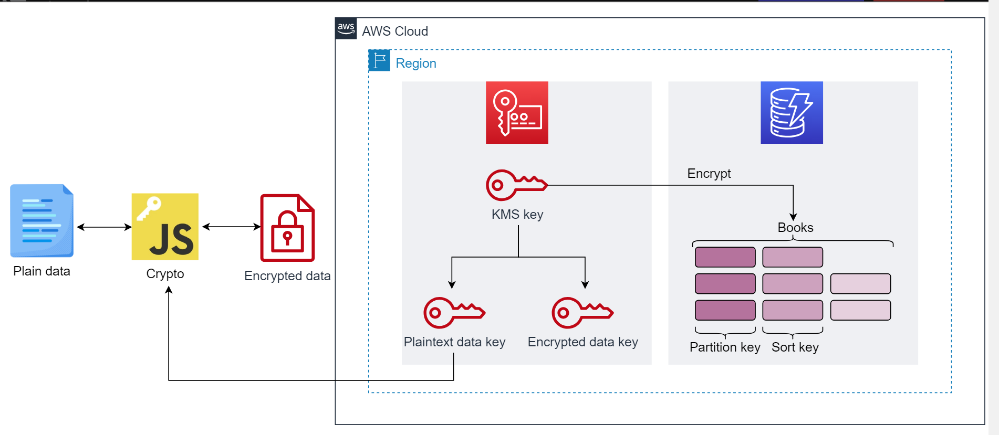

DynamoDB is a NoSQL database service provided by AWS. It’s a key-value and document-based database that’s fully managed and provides high performance at scale. It stores data in the form of tables.

### Create a table
Let’s create a DynamoDB table using the AWS Console. Follow the steps below to create the table:

- Use the AWS Console search bar to search for “DynamoDB” and select “DynamoDB” from the search results. This redirects us to the DynamoDB dashboard.

- On the DynamoDB dashboard, click the “Create table” button. This will open the “Create table” page.

- On the “Create table” page, enter the following values:

- Enter the table name as Books.

- Add a partition key Author and set its data type as “String.”

- Add a sort key Book_Title and set its data type as “String.”

- In the “Table settings” section, select the “Customize settings” option.

- Scroll down to the “Encryption at rest” section and select the “Stored in your account, and owned and managed by you” option. This enables us to use the customer managed key that we created earlier for encryption.

- Choose “myKey” from the newly populated drop-down menu.
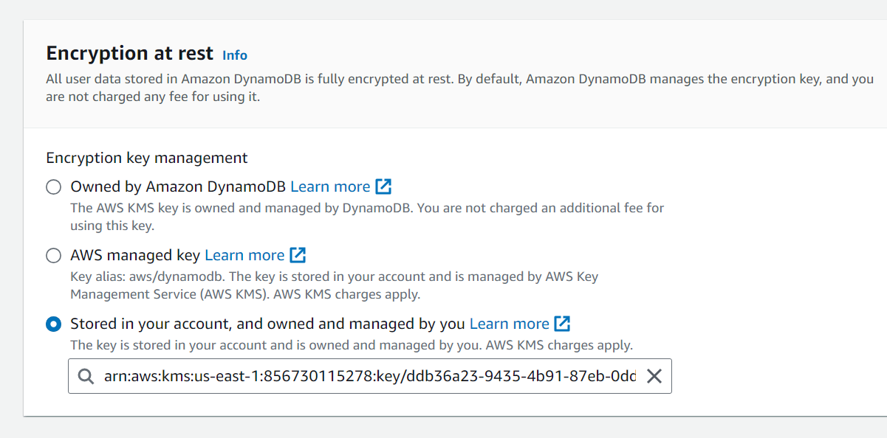

- Let the other settings remain as they are, and click the “Create table” button.

We’ll be redirected to the “Tables” page. Our new “Books” table should be visible in the list with the status “Creating.” This status should change to “Active” in a few seconds.

#### Add an item to the table
Follow the steps below to add items to the table that we created in the previous task:

- On the “Tables” page, click the “Books” table we just created. Then click the “Explore table items” button, and then “Create item.”

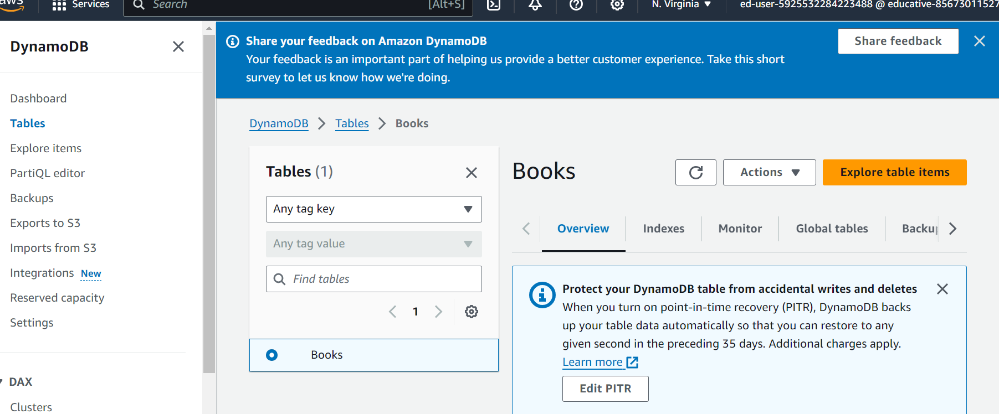
- For “Author,” enter Seth Godin.

- For “Book_Title,” enter The Dip.

- Click the “Create item” button.

- Our item should now be visible under the “Items returned” section.

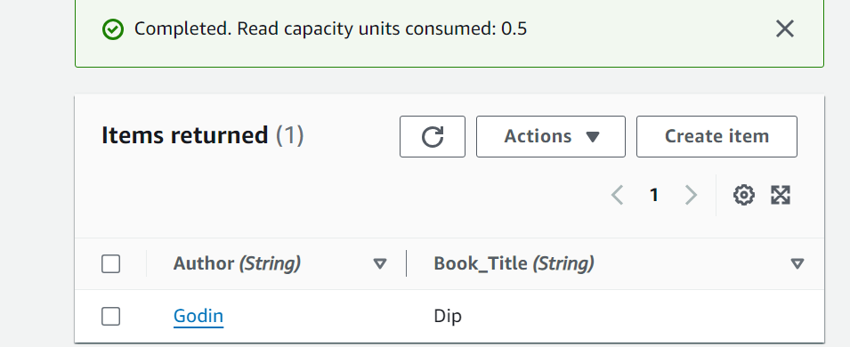

## Read the DynamoDB Table with a Different User ID

In this task, we’ll read the data from the table using a different IAM user.

As mentioned in the first task, we have a pre-built IAM user in this lab. Here's the policy attached to this user:

```json
{
  "Version": "2012-10-17",
  "Statement": [
    {
      "Effect": "Allow",
      "Action": [
        "dynamodb:GetItem",
        "dynamodb:Query",
        "dynamodb:Scan"
      ],
      "Resource": "arn:aws:dynamodb:us-east-1:*:table/Books"
    },
    {
      "Effect": "Allow",
      "Action": [
        "dynamodb:Describe*",
        "dynamodb:list*"
      ],
      "Resource": "*"
    }
  ]
}
```

As we can see, the policy allows the user to read data from the DynamoDB table titled “Books.” So the user should be able to read data from the “Books” table that we created in the previous task. Let’s look at how KMS affects this process by logging in with this user and trying to read the table data.

To log in with this user, we’ll first need to set up its sign-in credentials to grant it access to the AWS Console. We can do that by creating a login profile for the user.

### Create a login profile
A login profile is a component of AWS IAM that allows us to create a password for our AWS account. Follow these steps to create a login profile for the IAM user:

- Head over to the “IAM” dashboard using the AWS Console search bar and select users from the sidebar.

- Select “IAMLabUser” from the list of users.

- Select the “Security credentials” tab and click the “Enable console access” button.

- Select the “Enable” option from the drop-down menu.

- Select “Custom password” from the newly populated options and enter NewUs@r150 as the password in the window under the option.

- Click the “Apply” button to create the login profile.

### Log in using a different ID
Now, let’s log in as the IAM user. Follow the given steps to proceed:

- Open a new private window and use that to log in as IAMLabUser without logging out from your current AWS session. We’re using a new private window because we can’t have multiple AWS sessions running on the same browser.

- Copy the sign-in link for the IAM user from the console and open it in the private window.

- Enter IAMLabUser for “IAM user name.”

- Enter NewUs@r150 as the password.

- Click the “Sign in” button to log in to the console.

We’ve successfully signed in as the IAMLabUser user.

### Scan the table
Follow the steps below to scan the table:

- Navigate to the DynamoDB dashboard using the AWS Console search bar and select “Tables” from the sidebar.

- On the “Tables” page, click the “Books” table and then click the “Explore table items” button.

- Once the items are in view, there will be two options on the top, namely, “Scan” and “Query.” Select the “Scan” option.

- Select the “Books” table from the drop-down menu.

- Click the “Run” button and view the results.

Even though this user has permission to read data from this table, we won’t be able to do it because the data is encrypted using the customer managed key, and this user doesn’t have permission to use that key. Therefore, if we’re dealing with a resource secured using KMS, it’s not just IAM policies that come into play. 

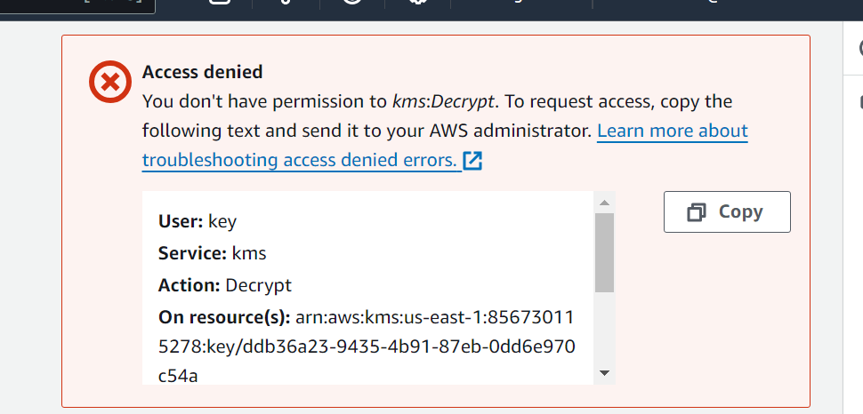

We also need to consider the key policy associated with the KMS key used for encryption. Because of the options selected during key creation, only the main account associated with this lab is allowed to use the KMS key. If we want to allow the IAM user to read the table data, we’ll have to modify that key policy to allow the IAM user to use the key.

## Modify the Key Policy

Now let’s modify the policy of our customer managed key and allow the IAM user to use the KMS for encryption and decryption.

### Main account tasks
These tasks are to be done using the main account of this lab.

### Fetch the ARN of the IAM user
Before we modify the policy, we need the ARN of the IAM user whose ID we used in the previous task.

Follow these steps to obtain the ARN:

- Search for “IAM” using the search bar.

- Select users from the left sidebar.

- Click the “IAMLabUser” from the list of the user.

- Copy the ARN of the user.

### Modify the policy
Now that we have the required ARN, follow these steps to modify the policy:

- Navigate to the KMS dashboard and select “Customer-managed keys” from the left sidebar.

- Click the name of the customer managed key on your key.

- Click the “Switch to policy view” button.

- Click the “Edit” button to open the editor for policy.

Replace <[IAM_ARN]> in line 5 with the ARN of the IAM user whose ID we used in the previous task, and then add this statement to line 5 of the policy of the customer managed key:

```json
{
    "Sid": "Allow use of the key",
    "Effect": "Allow",
    "Principal": {
        "AWS": "<IAM_ARN>"
    },
    "Action": [
        "kms:Encrypt",
        "kms:Decrypt"
    ],
    "Resource": "*"
},
```
add this json to policies anywhere!!

like this 

```json
{
    "Version": "2012-10-17",
    "Id": "key-consolepolicy-3",
    "Statement": [
        {
            "Sid": "Enable IAM User Permissions",
            "Effect": "Allow",
            "Principal": {
                "AWS": "arn:aws:iam::856730115278:root"
            },
            "Action": "kms:*",
            "Resource": "*"
        },
        //added here
        {
            "Sid": "Allow use of the key",
            "Effect": "Allow",
            "Principal": {
                "AWS": "arn:aws:iam::856730115278:user/IAMLabUser"
            },
            "Action": [
                "kms:Encrypt",
                "kms:Decrypt"
            ],
            "Resource": "*"
        },
        {
            "Sid": "Allow access for Key Administrators",
            "Effect": "Allow",
            "Principal": {
                "AWS": "arn:aws:iam::856730115278:user/ed-user-09cf21b7"
            },
            "Action": [
                "kms:Create*",
                "kms:Describe*",
                "kms:Enable*",
                "kms:List*",
                "kms:Put*",
                "kms:Update*",
                "kms:Revoke*",
                "kms:Disable*",
                "kms:Get*",
                "kms:Delete*",
                "kms:TagResource",
                "kms:UntagResource",
                "kms:ScheduleKeyDeletion",
                "kms:CancelKeyDeletion",
                "kms:RotateKeyOnDemand"
            ],
            "Resource": "*"
        },
        {
            "Sid": "Allow use of the key",
            "Effect": "Allow",
            "Principal": {
                "AWS": "arn:aws:iam::856730115278:user/ed-user-09cf21b7"
            },
            "Action": [
                "kms:Encrypt",
                "kms:Decrypt",
                "kms:ReEncrypt*",
                "kms:GenerateDataKey*",
                "kms:DescribeKey"
            ],
            "Resource": "*"
        },
        {
            "Sid": "Allow attachment of persistent resources",
            "Effect": "Allow",
            "Principal": {
                "AWS": "arn:aws:iam::856730115278:user/ed-user-09cf21b7"
            },
            "Action": [
                "kms:CreateGrant",
                "kms:ListGrants",
                "kms:RevokeGrant"
            ],
            "Resource": "*",
            "Condition": {
                "Bool": {
                    "kms:GrantIsForAWSResource": "true"
                }
            }
        }
    ]
}
```

This statement allows the IAM user to use the KMS key for encryption/decryption.

- Click the “Save changes” button.

now scan done by IAMLab user
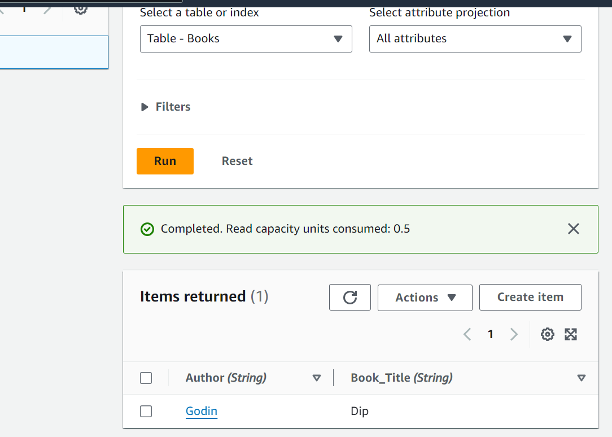

## Clean Up

To finish this lab, let’s clean up the resources we’ve created. We’ll delete the resources in reverse order from the creation.

## Delete the DynamoDB table
Follow the steps below to delete the DynamoDB table:

- Head over to the DynamoDB dashboard.

- On the “Tables” page, select the “Books” table.

- Click the “Delete” button.

- It will show us a confirmation pop-up. Type confirm and click the “Delete” button.

## Disable the customer managed key
Follow these steps disable the customer managed key:

- Navigate to the KMS dashboard.

- Select “Customer-managed keys” from the left sidebar.

- Select “myKey” using the check mark and click the “Key actions” button to open the drop-down menu associated with it.

- Select the “Disable” option from the drop-down menu.

- Confirm that you want to disable the key by checking the confirmation check mark and then clicking the “Disable key” button.
